# Vue

computed和watch监听器的区别

watch可以监听到数据变更，并作对应的逻辑处理、接口请求等，并不一定只是修改某个变量（computed）的值


## VsCode插件安装

1. Vue 3 Snippets


Vue实例中所有带**"$"**符号的都是Vue为程序员准备的变量，所有不带$符号的都是底层在使用的变量

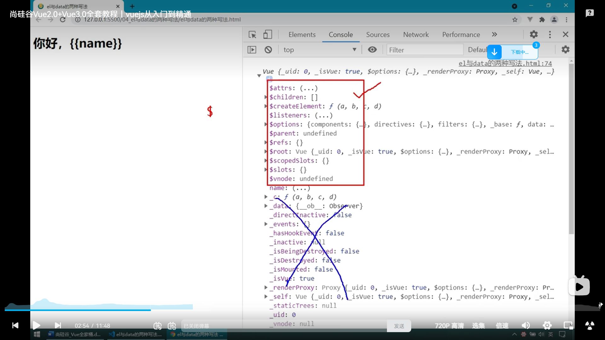

+ el 和 data的两种写法

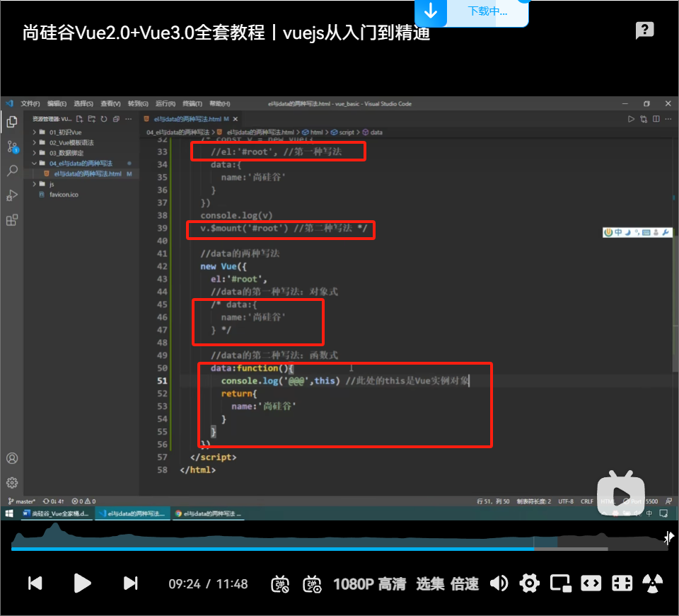

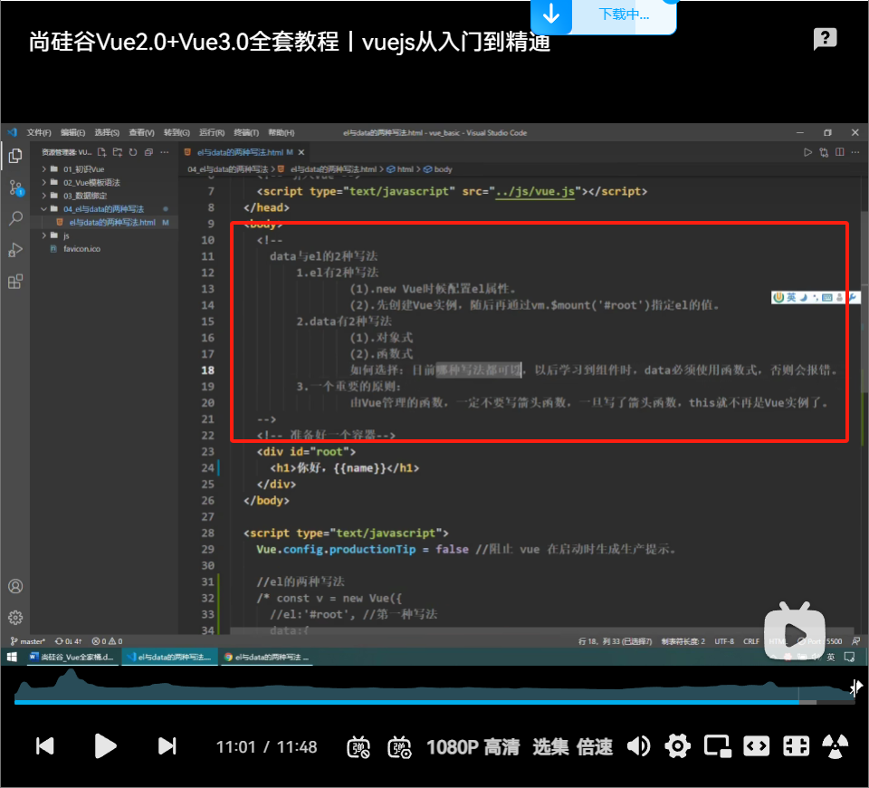


defineProperty**数据代理**：通过一个对象代理对另一个对象中属性的操作（读、写）    -------------这边涉及到【数据劫持】，什么是数据劫持

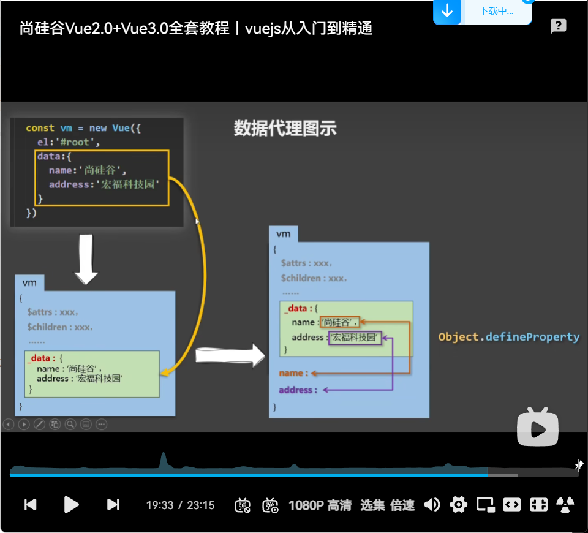


+ **事件修饰符（修饰符可以连续写： .stop.prevent）**

1. event.preventDafault     =>   .prevent (阻止默认行为，比如a标签的跳转行为)

2. .stop 阻止事件冒泡

3. .once 事件只触发一次

4. .capture 使用事件的捕获模式

5. .self 只有event.target 是当前操作的元素时才触发事件

6. .passive 时间的默认行为立即执行，无需等待事件回调执行完毕

   比如@wheel事件发生时（鼠标滚轮滚动时）会先执行对应的回调函数，再移动滚动条。如果回调函数执行时间较长滚动条就会暂时不移动，有一种卡顿住的感觉，此时使用@wheel.passive就能解决该问题，该修饰符常用在配合移动端的应用时

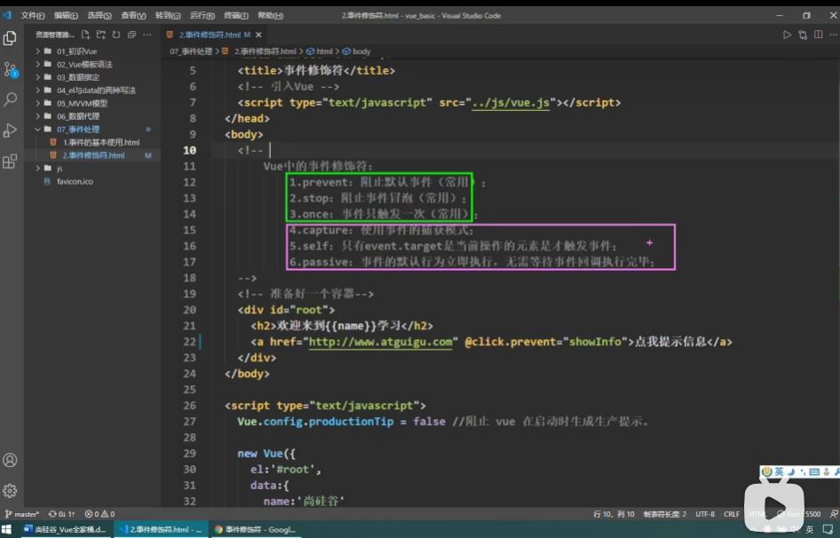


  

+ 键盘事件（可以连续写： @keydown.ctrl.y => 需要输入【ctrl+y】才会触发）

  @keydown 按键按下的时候触发、@keyup按键按下抬起的时候触发

  1. **Vue中常用的按键别名：**

     + 回车 => enter
     + 删除 => delete（捕获”删除Delete“或者”退格Backspace“键）
     + 推出 => esc
     + 空格 => space
     + 换行 => tab（**特殊，必须配合keydown，不然点击tab不起作用且直接跳转到下一个可聚焦的元素上**）
     + 上 => up
     + 下 => down
     + 左 => left
     + 右 => right 
  2. Vue未提供别名的按键，可以使用按键**原始的key值(监听keyup事件输出event.key)**去绑定，但注意要转为kebab-case（短横线命名，如CapsLock => @keyup.caps-lock）
  3. 比上面**Tab键**更特殊的系统修饰键（用法特殊）：**ctrl、alt、shift、meta（及电脑的windows键）**
     + 配合keyup使用：按下修饰键的同时，再按下其他按键，随后释放其他键，事件才被触发
     + **配合keydown使用：直接使用即可，可以正常触发事件**
  4. Vue.config.keyCodes.自定义键名 = 键码，可以去定制案件别名

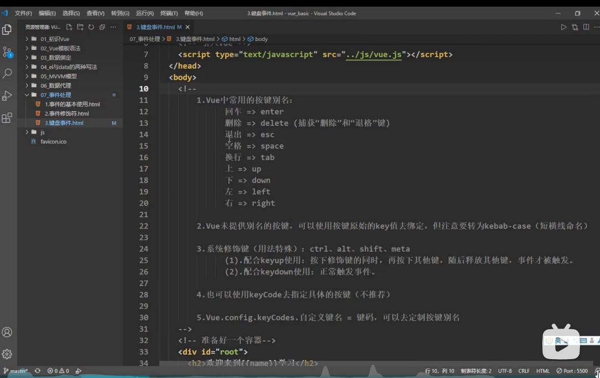


### 计算属性computed

1.  定义：要用的属性不存在，要通过Vue实例中data已有的属性去计算得来，计算属性最终会出现在Vue实例上，直接读取即可，不能通过调用方法【如fullName.get()】的形式；
2. 原理：底层借助了Object.defineProperty方法提供的getter和setter；
3. get函数什么时候执行：
   + 初次读取该计算属性的时候会执行一次（重复执行时不会再调用了）
   + 当依赖的数据发生改变时会再次执行
4. 与method相比的优势：内部有缓存机制（可以实现复用），效率更高，在Vue的开发者工具中能看到所有的计算属性，调试更方便；
5. 备注：如果计算属性要被修改，那就必须写set函数去响应修改，且set中要引起该计算属性计算时所依赖的数据发生改变，才能引起getter的改变。不过一般情况下计算属性只需要getter，此时可以用计算属性的简写形式。

 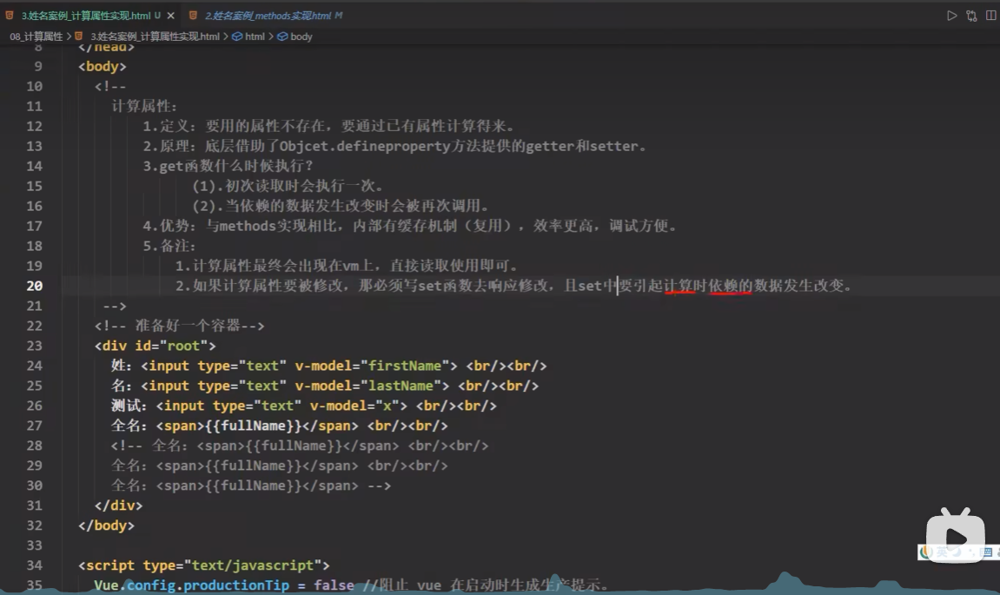

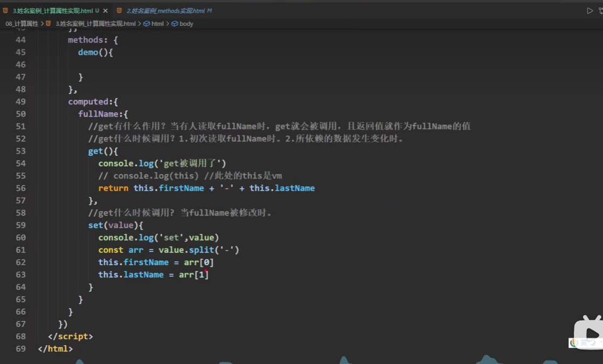


### 监视属性watch

1. 当监视属性变化时，回调函数自动调用；监视的属性必须存在才能进行监视，否则写了没意义

2. 坚实的两种写法：

   + 通过new Vue时的watch配置

   + 通过vm.$watch监视

     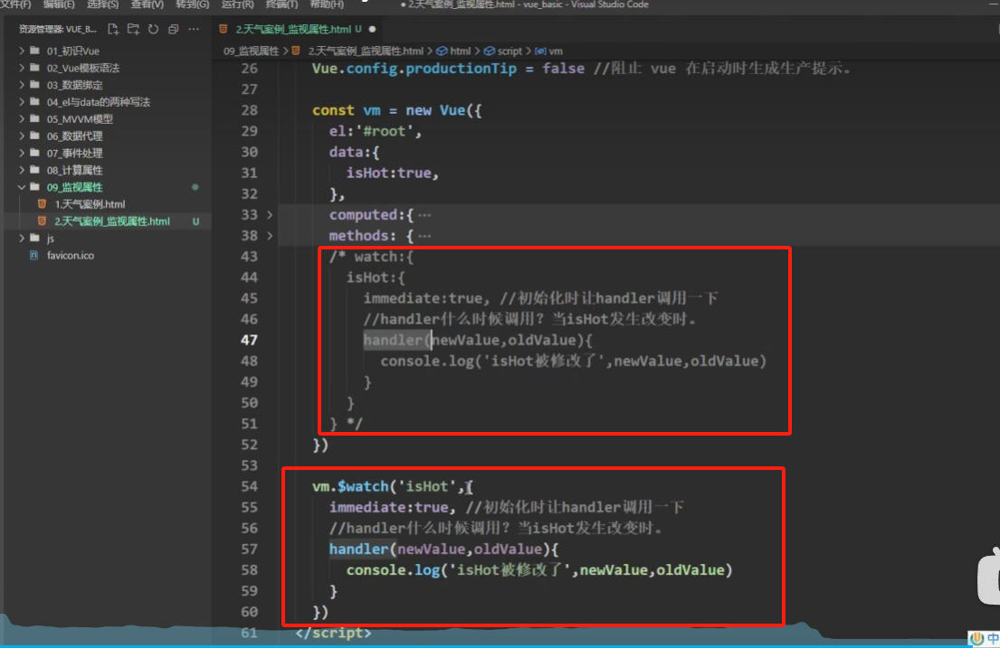

3. 深度监视

   + Vue中的watch默认不监测对象内部值得改变，只能监测到data下的第一层属性；配置 **deep:true** 可以监测对象内部值得改变（可以实现监听到data下有多层级的对象属性）

   + Vue自身可以监测对象内部值的改变（如从改了内部值number.a后，界面上展示number.a的数据对应更新可知），但Vue提供的watch默认不可以

   + 使用watch时根据数据的具体结构决定是否采用深度监视

     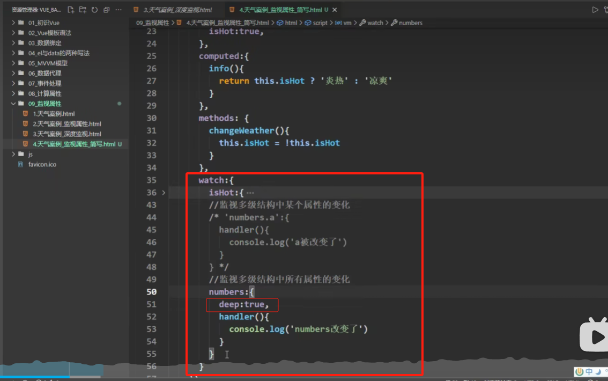

4. 简写形式（当不需要配置 **immediate** 和 **deep** 的时候可以用简写的形式）：

   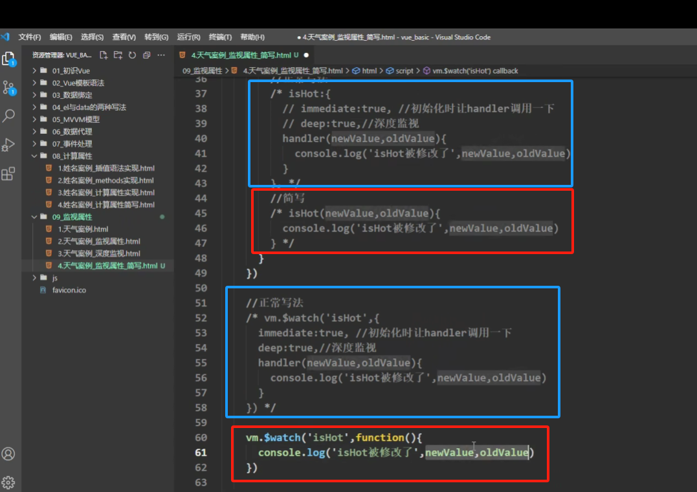

5. **和computed的比较：**

   + computed能完成的功能，watch都可以完成，**首选用computed实现**
   + watch能完成的功能，computed不一定能完成，例如watch可以进行异步操作，computed就不行
   + 两个重要的小原则：
     + 所有被Vue管理的函数（如computed、watch、methods等）最好写成普通函数，这样this的指向才是vm或组件实例对象；
     + 所有不被Vue所管理的函数（如定时器的回调函数、ajax的回调函数、Promise的回调函数）最好写成箭头函数，这样this的指向才是vm或组件实例对象


### 绑定样式（:class、:style）

1. class样式写法  **:class="xxx"**,xxx可以是字符串、对象、数组
   + 字符串适用于类名不确定，要动态获取（指定一个类名）
   + 对象写法适用于：要绑定多个样式，个数确定、名字也确定，但要动态决定用不用（通过属性值true或者false来启用停用）
   + 数组写法适用于：要绑定多个样式，个数不确定，类名也不确定，要新增class类就直接push进去即可

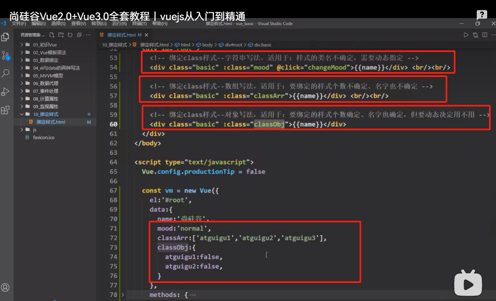


### 列表循环指令 v-for

用于展示数据，可遍历数组、对象、字符串（类似数组）、指定次数（例如：v-for="item in 5"）

+ key的作用和原理：key是虚拟DOM对象的标识，当状态中的数据发生变化的时候，Vue会根据【新数据】生成【新的虚拟DOM】，随后Vue进行【新的虚拟DOM】与【旧的虚拟DOM】的差异比较。

+ 比较规则如下：

  + 旧的虚拟DOM中找到了与新的虚拟DOM相同的key：

    + 若虚拟DOM中的内容没变，**直接使用之前的真实DOM**
    + 若虚拟DOM中内容变了，则生成新的真实DOM，随后替代掉页面中之前的真实DOM

  + 旧的虚拟DOM中未找到与新的虚拟DOM相同的key则创建新的真实DOM，随后渲染到页面上。

  + index作为key（不写key时默认将index作为key）：

    可能引发的问题：

    + 若对数据进行逆序添加、逆序删除等破坏顺序的操作，会产生没有必要的真实DOM更新 => 界面效果没问题，但效率低
    + 如果结构中还包含输入类的DOM，则会产生错误的DOM更新 => 界面有问题

    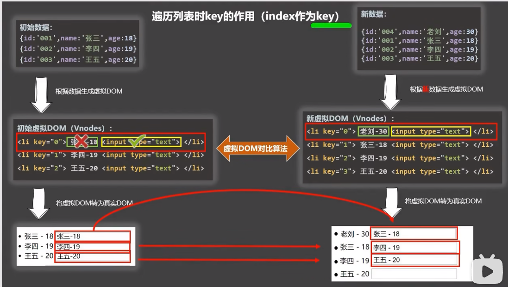

    

  + id作为key（首选，要使用每条数据的唯一标识作为key）：

    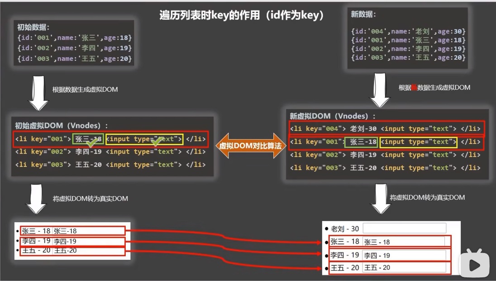


### Vue监视数据的原理：

1. Vue会监视data中所有层次的数据（无论对象有几个层级）
2. 如何检测对象中的数据：
   + 通过setter实现监视，且要在new Vue时就传入要监测的数据
   + 对象中后追加的属性，Vue默认不做响应式处理，如需给后追加的属性做响应式，则使用如下API：
     + Vue.set( target, propertyName/ArrayIndex, value)
     + Vue实例对象vm.$set( target, propertyName/ArrayIndex, value)
3. 如何监测数组中的数据：
   + 通过包裹数组更新元素的方法实现，在Vue修改数组中的某个元素一定要用可以改变原数组的方法：**push、pop、shift、unshift、reverse、sort、splice**，调用方法本质就是做了如下两件事：
     + 调用原生对应的数组方法对数组进行更新
     + 重新解析模板，进而更新页面
   + 使用如上2中的监测对象方法Vue.set()、vm.$set()也可以修改Vue数组数据
4. 特别注意：**Vue.set()和vm.$set() 不能给vm或vm的根数据对象（即vm._data属性）添加属性**，否则控制台会直接报错。


### v-model收集表单数据

1. 若<input type="text" />，则v-model收集的是用户输入的value值；
2. 若<input type="radio" />，v-model收集的是value值，所以要给标签配置value值；
3. 若<input type="checkbox" />，如果没有配置value属性，则v-model收集的就是checked（布尔值，即是否勾选上）；如果有配置value属性：
   + v-model的初始值是非数组，则v-model收集的依旧是checked；
   + v-model的初始值是数组，则v-model收集的就是value组成的数组
4. v-model的三个修饰符：
   + lazy：失去焦点时再收集数据
   + number：输入字符串转为有效的数字，通常和input的type=“number”联合使用；
   + trim：会过滤掉输入的首尾空格


### 过滤器

+ 定义：对要显示的数据进行特定格式化后再显示（适用于一些简单逻辑的处理）
+ 语法：
  + 注册过滤器：Vue.filter(name, callback) 或 new Vue({ filters: {}})
  + 使用过滤器： {{xxx | 过滤器名}} 或 v-bind:属性="xxx | 过滤器名"
+ 备注：
  + 过滤器可以接受额外参数，多个过滤去也可以串联
  + 并没有改变原本的数据，是产生新的格式化数据用于展示

+ 局部过滤器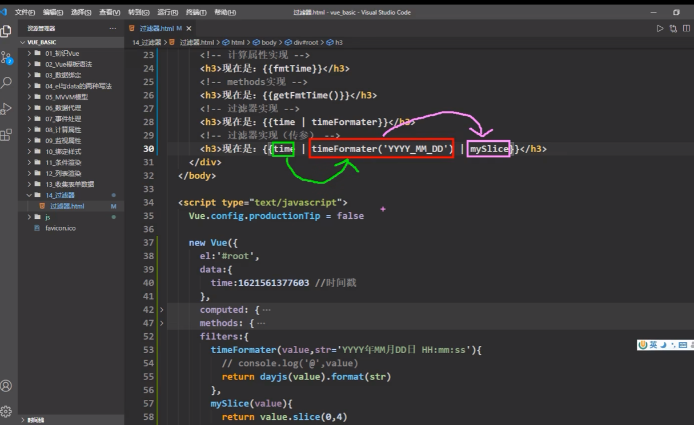

+ 全局过滤器

  ```vue
  Vue.filter('myFilter', function(value){
    return value.slice(0, 4)
  })
  ```


### 内置指令

1. v-text：作用是向其所在的节点中渲染文本内容，与{{}}插值语法的区别是v-text会替换掉节点中的内容，插值语法不会；

2. v-html：作用是向指定节点中渲染包含html结构的内容，与插值语法的区别是v-html会替换掉节点中的所有内容，而插值语法不会，且v-html可以识别html结构。**严重注意：**v-html有安全性问题！！！在网站上动态渲染任意HTML是非常危险的，容易导致XSS攻击，一定要在可信的内容上使用v-html，永远不要用在用户提交的内容上！

   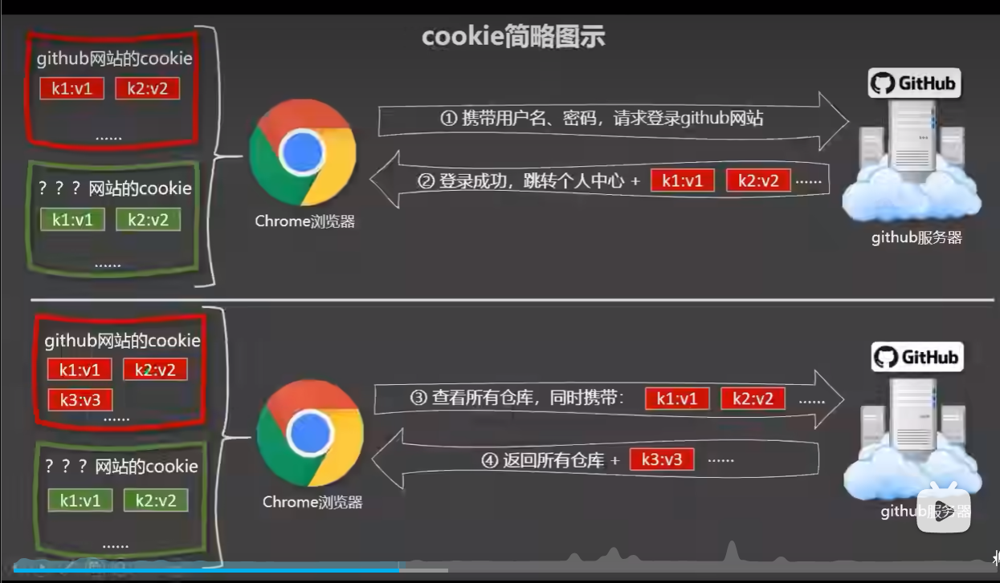

3. v-clock指令（无需赋值）：本质是一个特殊的属性，Vue实例创建完毕并接管容器后，会删掉v-clock属性，使用CSS（如：【v-clock】{display：none}）配合v-clock可以解决网速慢时页面展示出源代码{{xxx}}的问题

4. v-once：所在的节点在初次动态渲染后，就视为静态内容了，以后数据的改变不会引起v-once所在结构的更新，可以用于优化性能


### 自定义指令


# 前端开发工程师


## 1. 第1周HTML5基础语法与标签

### 工具安装

+ VsCode

  1. 中文配置：插件图标搜索**“Chinese”**，直接安装即可

  2. 颜色主题：文件 => 首选项 => 颜色主题 => Light+

  3. IDEA、Sublime快捷键：插件图标搜索**“IDEA”、“Sublime”**，直接安装即可。多行编辑：**按住鼠标滚轮然后下拉**，即可进行多行编辑

     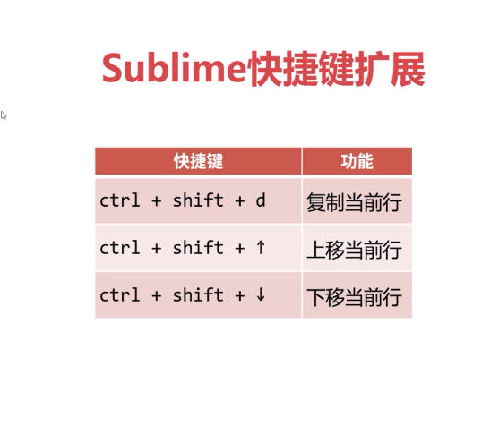

  4. ctrl+鼠标滚轮缩放字号：文件 => 首选项 => 设置 => 搜索**“滚动”** => 勾上Mouse Wheel Zoom

  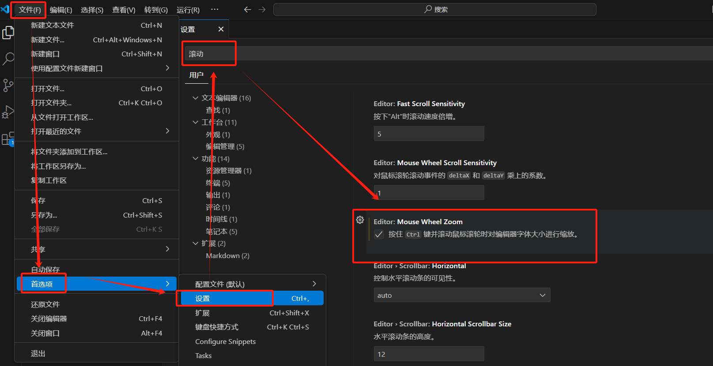

+ webStorm
+ IDEA

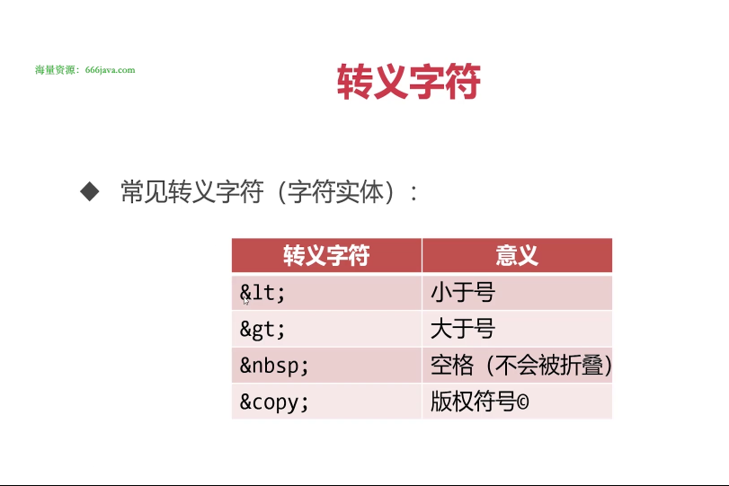


## Html5

### 语法和基本标签

1. 文字和文字之间的多个空格、换行会被折叠成一个空格

   ```html
   <p>文字    文字</p>  => 最终渲染的时候两个“文字”之间只有一个空格
   ```

2. 标签”内壁“和文字之间的空格会被忽略。

   <p>    文字     </p>  => 最终渲染的时候两个“文字”两边的空格会被忽略不会展示空格出来

3. 转义字符

   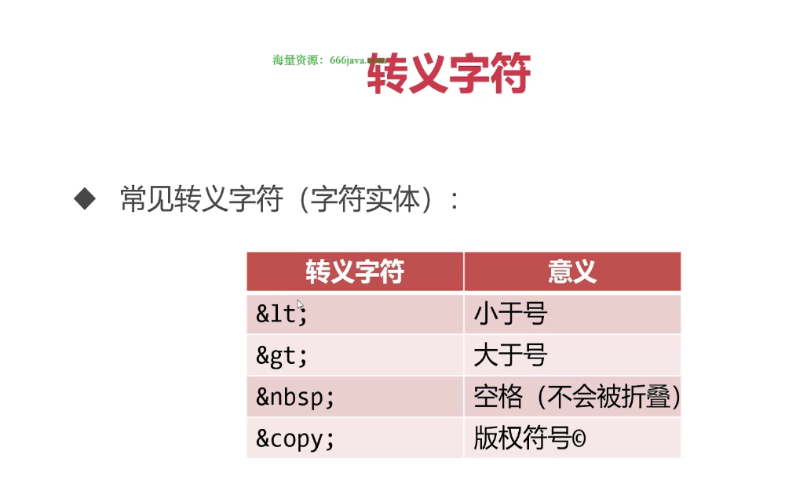

# Javascript 高级程序设计

+ isNaN()
+ Number()


# 混合开发

+ 定义：混合开发是一种开发模式，英文名Hybrid APP，混合开发使用Native和Web技术开发。
+ 核心技术：**JSBridge桥接器**，实现Native端和Web端双向通信的一种机制，以Javascript引擎或WebView容器为媒介，通过约定的协议进行通信。

+ 优点：开发快、易更新、开发周期短

+ 缺点：性能问题（相对原生而言）、兼容性问题（Web浏览器兼容问题），但是再Android 5.0+和IOS9.0+上缺点就不再明显

+ 应用场景：

  + 微信公众号，通过JSSDK连接Native端和Web端

    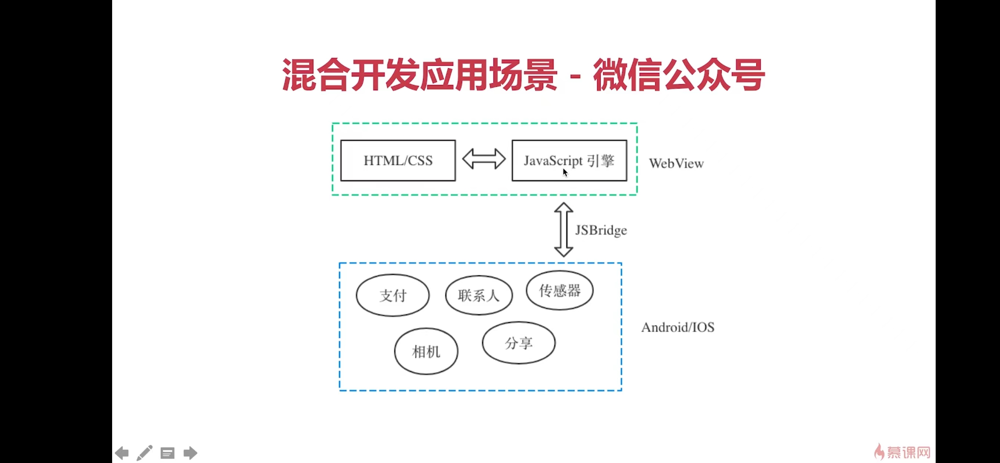

  + 微信小程序，通过内置框架连接Native端和Web端

    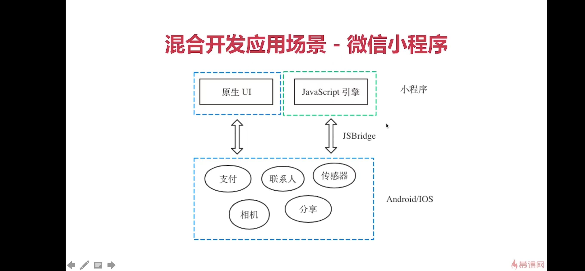

+ 混合开发主流前端框架

  + Web渲染：Cordova

  + 原生渲染：React Native、Weex

  + 混合渲染：微信小程序


## 混合开发核心技术解析

### JSBridge实现原理

+ 类比Client、Server模式
+ 将Native原生端接口封装成Javascript接口
+ 将Web端Javascript接口封装成原生接口
+ Web端和Native原生端之间双向通信

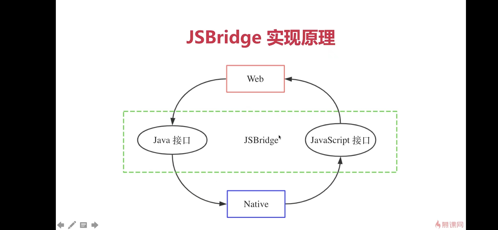


### JSBridge 的两种实现方式（Web端去调用原生端）

原生端调用web端只有一种，就是直接在原生端执行JS代码去调用web端代码

#### 方式一： 拦截WebView请求的URL Schema

URL Schema 是类URL的一种请求格式，格式为： <protocol>://<domain>/<path>?<query>

例子：http://www.google.com/search?keyword=jsbridge

+ 自定义JSBridge通信的URL Schema，如定义规则为：jsbridge://<method>?<params>，符合规则的URL Schema例子：jsbridge://showToast?text=hello&name=huang

  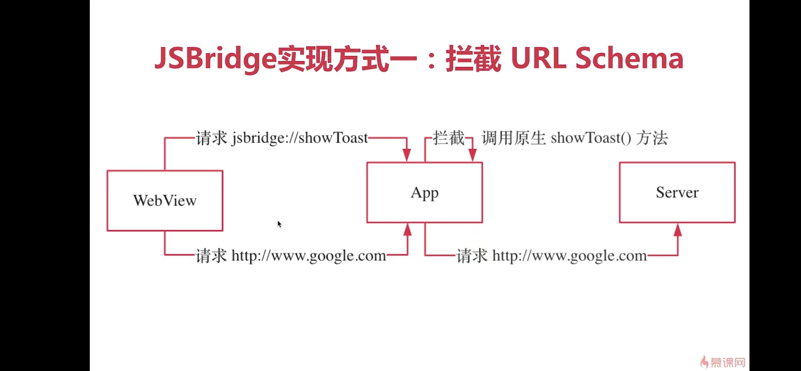

+ 优点：兼容性好

+ 缺点：不直观，URL长度有限制

#### 方式二： 向WebView注入 JS API 


# 概念理解

## Http接口状态码

## localStorage和sessionStorage

### 1. 相同点

localStorage和sessionStorage这两个都是用于存储客户端数据的，也被称为前端缓存或webStorage。**localStorage和sessionStorage的存储大小都是5M。**localStorage和sessionStorage都只能存储**字符串类型**数据。


### 2. 区别

1. 是否可以跨页面通讯

   + **使用sessionStorage缓存的数据不可进行跨页面通讯**，因为sessionStorage的生命周期是基于浏览器页面的。**注意：** 不过同一个页面下嵌套的iframe属于同源。同页面下的iframe之间可以进行通讯。

     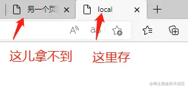

   + **使用localStorage缓存的数据可以进行跨页面通讯**。一个窗口存储的数据在另一个窗口可以拿到。

     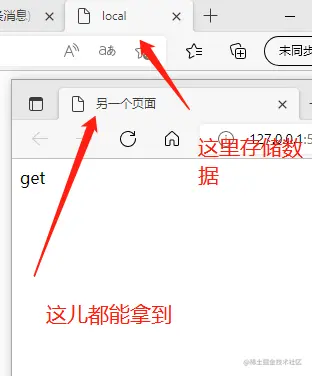

2. 是否会随着浏览器关闭而清除

   + **sessionStorgae存储的数据在页面被关闭以后会自动被清除不会保留。**
   + **localStorage存储的数据除非我们手动清除，否则一直存在。**


### 3. 应用场景

**最常用的就是登录信息了。localStorage的话比较适合长期有效的自动登录。**

**sessionStorage比较适用于短期有效的自动登录（比如token过期重新请求）。**

注意：在使用sessionStorage和localStorage的时候，存储的敏感数据（比如账号密码）最好都加密一下。

在浏览器的“应用程序”里是可以看到的↓ 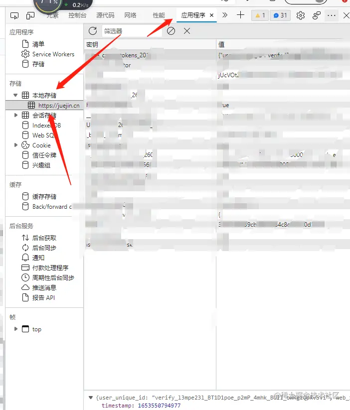


### 4. sessionStorgae和localStorage的使用方式

#### 4.1 sessionStorage

##### 存储

```javascript
sessionStorage.setItem("key","value");
```

##### 读取

```javascript
sessionStorage.getItem("key");
```

##### 删除指定键

```javascript
sessionStorage.removeItem("key");
```

##### 删除全部

```javascript
sessionStorage.clear();
```

#### 4.2 localStorage

##### 存储

```javascript
localStorage.setItem("key","val");
```

##### 读取

```javascript
localStorage.getItem("key");
```

##### 删除指定键

```javascript
localStorage.removeItem("key");
```

##### 删除全部

```javascript
localStorage.clear();
```


### 5. 结论

- **localStorage可以跨页面通讯。sessionStorage不可以跨页面通讯**
- **localStorage不会随着页面关闭而被清除，他只能手动清除。sessionStorage会随着页面的关闭而清除。**
- **localStorage和sessionStorage的存储大小都是5M。**


## web缓存

### 1. 什么是web缓存？

**web缓存主要指的是两部分：浏览器缓存和http缓存。**

**其中http缓存是web缓存的核心，是最难懂的那一部分,也是最重要的那一部分。**

浏览器缓存：比如,localStorage,sessionStorage,cookie等等。这些功能主要用于缓存一些必要的数据，比如用户信息。比如需要携带到后端的参数。亦或者是一些列表数据等等。不过这里需要注意。**像localStorage，sessionStorage这种用户缓存数据的功能，他只能保存5M左右的数据，多了不行。cookie则更少，大概只能有4kb的数据**


这篇文章重点讲解的是：前端http缓存。

> 官方介绍:Web 缓存是可以自动保存常见文档副本的 HTTP 设备。当 Web 请求抵达缓存时， 如果本地有“已缓存的”副本，就可以从本地存储设备而不是原始服务器中提取这 个文档。

举个例子↓

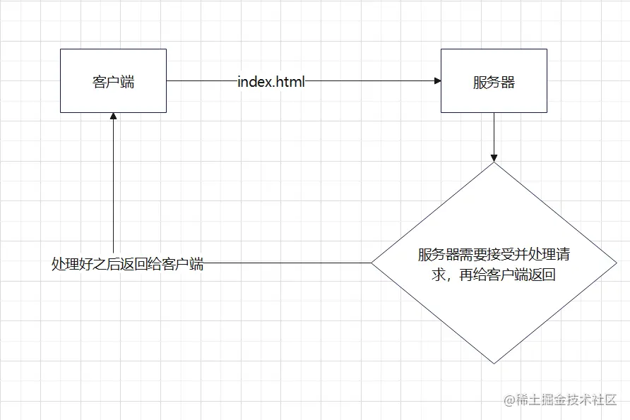

看图，问题就是出在，**服务器需要处理http的请求，并且http去传输数据，需要带宽，带宽是要钱买的啊。而我们缓存，就是为了让服务器不去处理这个请求，客户端也可以拿到数据。**

> 注意，我们的缓存主要是针对html,css,img等静态资源，常规情况下，我们不会去缓存一些动态资源，因为缓存动态资源的话，数据的实时性就不会不太好，所以我们一般都只会去缓存一些不太容易被改变的静态资源。

### 2. 缓存可以解决什么问题？他的缺点是什么？

先说说，缓存可以解决什么问题。

- **减少不必要的网络传输，节约宽带（就是省钱）**
- **更快的加载页面（就是加速）**
- **减少服务器负载，避免服务器过载的情况出现。（就是减载）**

再说说缺点

- 占内存（有些缓存会被存到内存中）

其实日常的开发中，我们最最最最关心的，还是"更快的加载页面";尤其是对于react/vue等SPA（单页面）应用来说，首屏加载是老生常谈的问题。这个时候，缓存就显得非常重要。不需要往后端请求，直接在缓存中读取。速度上，会有显著的提升。是一种提升网站性能与用户体验的有效策略。

http缓存又分为两种两种缓存，**强制缓存**和**协商缓存**,我们来深度剖析一下**强制缓存和协商缓存各自的优劣以及他们的使用场景以及使用原理**

**http缓存流程图↓**

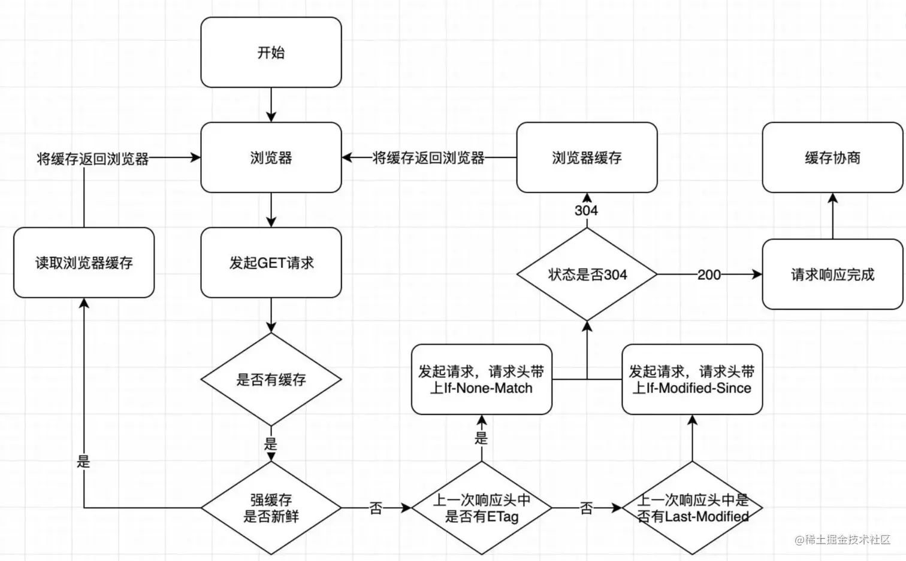

### 3. 强制缓存

强制缓存，我们简称强缓存。

从强制缓存的角度触发，如果浏览器判断请求的目标资源有效命中强缓存，如果命中，则可以直接从内存中读取目标资源，无需与服务器做任何通讯。

#### 3.1 基于Expires字段实现的强缓存

在以前，我们通常会使用响应头的`Expires`字段去实现强缓存。如下图↓

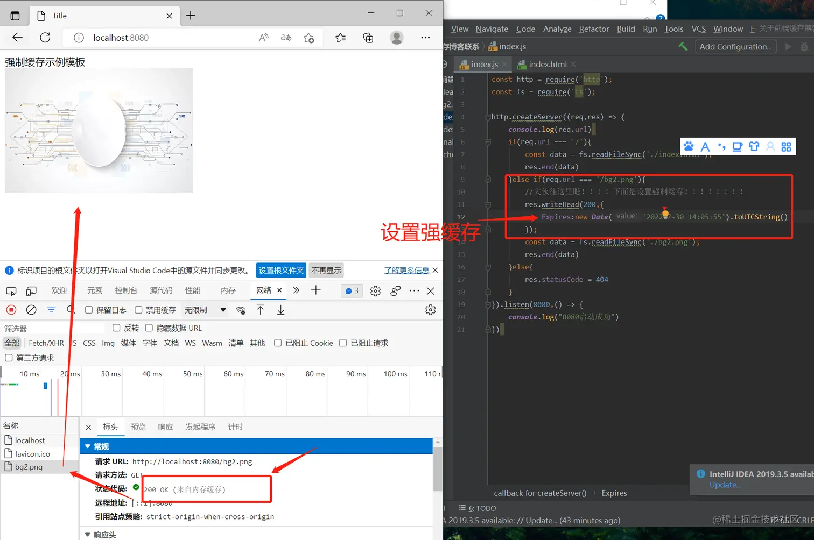

`Expires`字段的作用是，设定一个强缓存时间。在此时间范围内，则从内存（或磁盘）中读取缓存返回。

比如说将某一资源设置响应头为:Expires:new Date("2022-7-30 23:59:59")；

那么，该资源在2022-7-30 23:59:59 之前，都会去本地的磁盘（或内存）中读取，不会去服务器请求。

但是，**`Expires`已经被废弃了**。对于强缓存来说，`Expires`已经不是实现强缓存的首选。

**因为Expires判断强缓存是否过期的机制是:获取本地时间戳，并对先前拿到的资源文件中的`Expires`字段的时间做比较。来判断是否需要对服务器发起请求。这里有一个巨大的漏洞：“如果我本地时间不准咋办？”**

**是的，`Expires`过度依赖本地时间，如果本地与服务器时间不同步，就会出现资源无法被缓存或者资源永远被缓存的情况。所以，`Expires`字段几乎不被使用了。现在的项目中，我们并不推荐使用`Expires`，强缓存功能通常使用`cache-control`字段来代替`Expires`字段。**

没想到吧，整半天，这个属性是废的。


#### 3.2 基于Cache-control实现的强缓存（代替Expires的强缓存实现方法）

`Cache-control`这个字段在http1.1中被增加，`Cache-control`完美解决了`Expires`本地时间和服务器时间不同步的问题。是当下的项目中实现强缓存的最常规方法。

`Cache-control`的使用方法页很简单，只要在资源的响应头上写上需要缓存多久就好了，单位是秒。比如↓

```js
//往响应头中写入需要缓存的时间
res.writeHead(200,{
    'Cache-Control':'max-age=10'
});
复制代码
```

下图的意思就是，从该资源第一次返回的时候开始，往后的10秒钟内如果该资源被再次请求，则从缓存中读取。 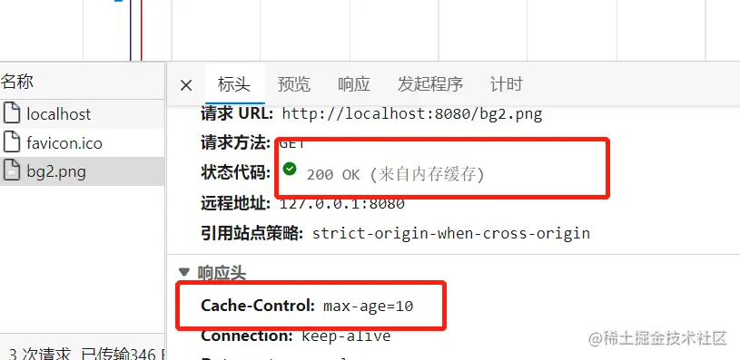

**Cache-Control:max-age=N，N就是需要缓存的秒数。从第一次请求资源的时候开始，往后N秒内，资源若再次请求，则直接从磁盘（或内存中读取），不与服务器做任何交互。**

`Cache-control`中因为max-age后面的值是一个滑动时间，从服务器第一次返回该资源时开始倒计时。所以也就不需要比对客户端和服务端的时间，解决了`Expires`所存在的巨大漏洞。

`Cache-control`有**max-age**、**s-maxage**、**no-cache**、**no-store**、**private**、**public**这六个属性。

- **max-age**决定客户端资源被缓存多久。
- **s-maxage**决定代理服务器缓存的时长。
- **no-cache**表示是强制进行协商缓存。
- **no-store**是表示禁止任何缓存策略。
- **public**表示资源即可以被浏览器缓存也可以被代理服务器缓存。
- **private**表示资源只能被浏览器缓存。


##### 3.2.1 no-cache和no-store

**no_cache**是`Cache-control`的一个属性。它并不像字面意思一样禁止缓存，实际上，**no-cache**的意思是强制进行协商缓存。如果某一资源的`Cache-control`中设置了**no-cache**，那么该资源会直接跳过强缓存的校验，直接去服务器进行协商缓存。而**no-store**就是禁止所有的缓存策略了。

> 注意，no-cache和no-store是一组互斥属性，这两个属性不能同时出现在`Cache-Control`中。


##### 3.2.2 public和private

一般请求是从客户端直接发送到服务端，如下↓


但有些情况下是例外的：比如，出现代理服务器，如下↓

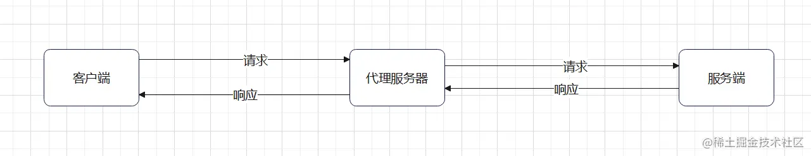

而**public**和**private**就是决定资源是否可以在代理服务器进行缓存的属性。

其中，**public**表示资源在客户端和代理服务器都可以被缓存。

**private**则表示资源只能在客户端被缓存，拒绝资源在代理服务器缓存。

如果这两个属性值都没有被设置，则默认为**private**

> 注意，**public**和**private**也是一组互斥属性。他们两个不能同时出现在响应头的`cache-control`字段中。


##### 3.2.3 max-age和s-maxage

**max-age**表示的时间资源在客户端缓存的时长，而**s-maxage**表示的是资源在代理服务器可以缓存的时长。

在一般的项目架构中**max-age**就够用。

而**s-maxage**因为是代理服务端的缓存时长，他必须和上面说的**public**属性一起使用（public属性表示资源可以在代理服务器中缓存）。

> 注意，**max-age**和**s-maxage**并不互斥。他们可以一起使用。

那么,Cache-control如何设置多个值呢？用逗号分割，如下↓

```
Cache-control:max-age=10000,s-maxage=200000,public
```

**强制缓存就是以上这两种方法了。现在我们回过头来聊聊，`Expires`难道就一点用都没有了吗？也不是，虽然`Cache-control是Expires`的完全替代品，但是如果要考虑向下兼容的话，在`Cache-control`不支持的时候，还是要使用`Expires`，这也是我们当前使用的这个属性的唯一理由。**

### 4. 协商缓存

> 温馨提示:协商缓存的内容会有一点点绕。需要仔细阅读。

#### 4.1 基于last-modified的协商缓存

基于last-modified的协商缓存实现方式是:

1. 首先需要在服务器端读出文件修改时间，
2. 将读出来的修改时间赋给响应头的`last-modified`字段。
3. 最后设置`Cache-control:no-cache`

三步缺一不可。

如下图↓

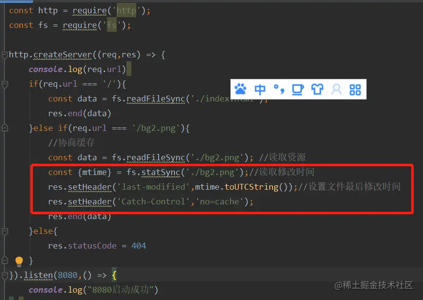

注意圈出来的三行。

第一行，读出修改时间。

第二行，给该资源响应头的`last-modified`字段赋值修改时间

第三行，给该资源响应头的`Cache-Control`字段值设置为:no-cache.(上文有介绍，Cache-control:no-cache的意思是跳过强缓存校验，直接进行协商缓存。)

**还没完。到这里还无法实现协商缓存**

当客户端读取到`last-modified`的时候，会在下次的请求标头中携带一个字段:`If-Modified-Since`。

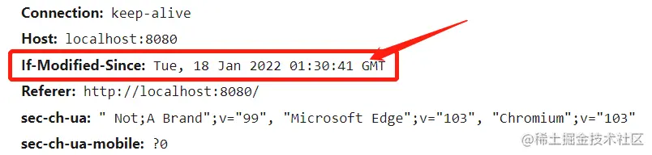

而这个请求头中的`If-Modified-Since`就是服务器第一次修改时候给他的时间，也就是上图中的

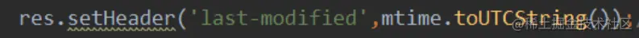 这一行。

**那么之后每次对该资源的请求，都会带上`If-Modified-Since`这个字段，而服务端就需要拿到这个时间并再次读取该资源的修改时间，让他们两个做一个比对来决定是读取缓存还是返回新的资源。**

如图↓

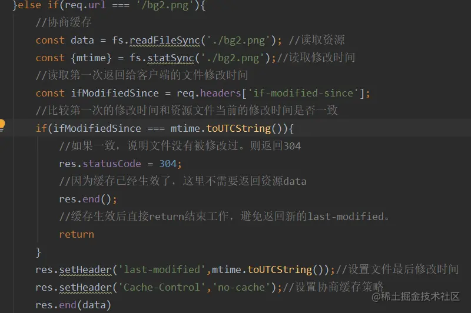

这样，就是协商缓存的所有操作了。

看到这里，有些小伙伴可能有些迷糊了。


没关系，我们用一张图来解释下协商缓存。

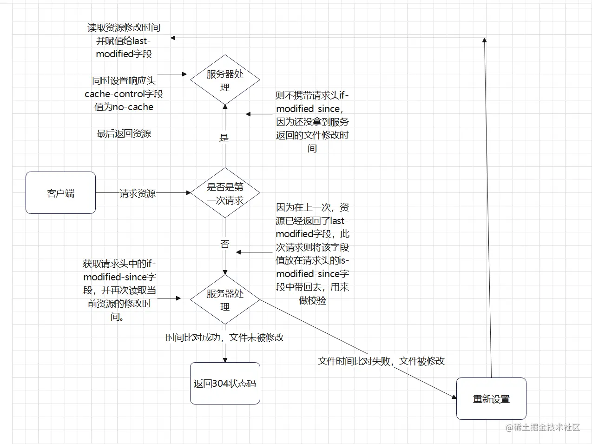

**使用以上方式的协商缓存已经存在两个非常明显的漏洞。这两个漏洞都是基于文件是通过比较修改时间来判断是否更改而产生的。**

**1.因为是根据文件修改时间来判断的，所以，在文件内容本身不修改的情况下，依然有可能更新文件修改时间（比如修改文件名再改回来），这样，就有可能文件内容明明没有修改，但是缓存依然失效了。**

**2.当文件在极短时间内完成修改的时候（比如几百毫秒）。因为文件修改时间记录的最小单位是秒，所以，如果文件在几百毫秒内完成修改的话，文件修改时间不会改变，这样，即使文件内容修改了，依然不会 返回新的文件。**

**为了解决上述的这两个问题。从`http1.1`开始新增了一个头信息，`ETag`(Entity 实体标签)**

又来新东西了，兄弟们顶住


#### 4.2 基础ETag的协商缓存

不用太担心，如果你已经理解了上面比较时间戳形式的协商缓存的话，`ETag`对你来说不会有难度。

`ETag`就是将原先协商缓存的比较**时间戳**的形式修改成了比较**文件指纹**。

> 文件指纹:根据文件内容计算出的唯一哈希值。文件内容一旦改变则指纹改变。

我们来看一下流程↓

1.第一次请求某资源的时候，服务端读取文件并计算出文件指纹，将文件指纹放在响应头的`etag`字段中跟资源一起返回给客户端。

2.第二次请求某资源的时候，客户端自动从缓存中读取出上一次服务端返回的`ETag`也就是文件指纹。并赋给请求头的`if-None-Match`字段，让上一次的文件指纹跟随请求一起回到服务端。

3.服务端拿到请求头中的`is-None-Match`字段值（也就是上一次的文件指纹），并再次读取目标资源并生成文件指纹，两个指纹做对比。如果两个文件指纹完全吻合，说明文件没有被改变，则直接返回304状态码和一个空的响应体并return。如果两个文件指纹不吻合，则说明文件被更改，那么将新的文件指纹重新存储到响应头的`ETag`中并返回给客户端

代码图例↓

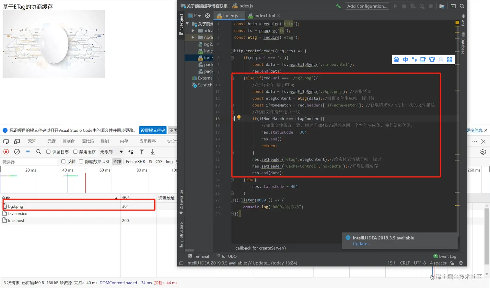

流程示例图↓

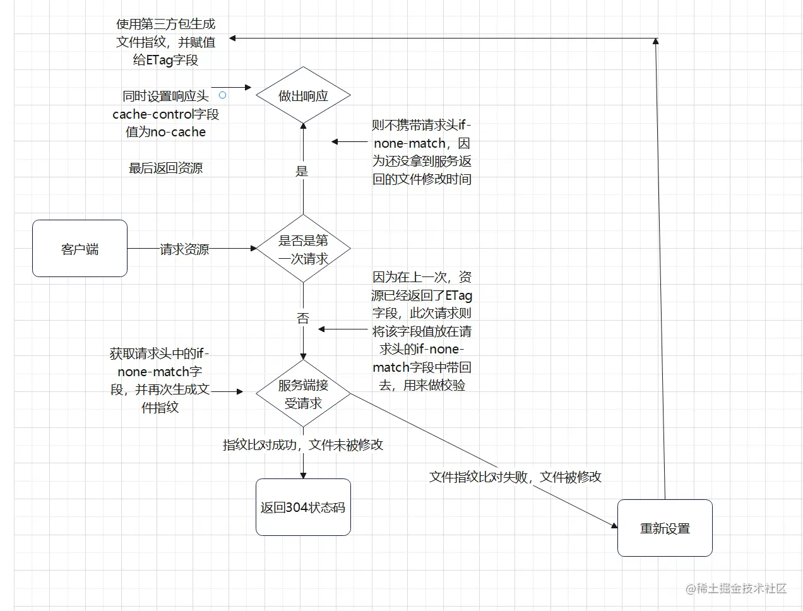

> 从校验流程上来说，协商缓存的修改时间比对和文件指纹比对，几乎是一样的。


##### ETag也有缺点

- **ETag需要计算文件指纹这样意味着，服务端需要更多的计算开销。。如果文件尺寸大，数量多，并且计算频繁，那么ETag的计算就会影响服务器的性能。显然，ETag在这样的场景下就不是很适合。**
- **ETag有强验证和弱验证，所谓将强验证，ETag生成的哈希码深入到每个字节。哪怕文件中只有一个字节改变了，也会生成不同的哈希值，它可以保证文件内容绝对的不变。但是，强验证非常消耗计算量。ETag还有一个弱验证，弱验证是提取文件的部分属性来生成哈希值。因为不必精确到每个字节，所以他的整体速度会比强验证快，但是准确率不高。会降低协商缓存的有效性。**

> 值得注意的一点是，不同于`cache-control`是`expires`的完全替代方案(说人话:能用`cache-control`就不要用`expiress`)。`ETag`并不是`last-modified`的完全替代方案。而是`last-modified`的补充方案（说人话：项目中到底是用`ETag`还是`last-modified`完全取决于业务场景，这两个没有谁更好谁更坏）。


### 5. 如何设置缓存

**从前端的角度来说:**

你什么都不用干，缓存是缓存在前端，但实际上代码是后端的同学来写的。如果你需要实现前端缓存的话啊，通知后端的同学加响应头就好了。

**从后端的角度来说**

请参考文章，虽然文章里的后端是使用node.js写的，但我写了详细的注释。对于后端的同学来说。应该不难看懂。

### 6. 哪些文件对应哪些缓存

这个，我确实忘了说。哈哈哈。

有哈希值的文件设置强缓存即可。没有哈希值的文件（比如index.html）设置协商缓存

**为什么有哈希值的文件设置强缓存**


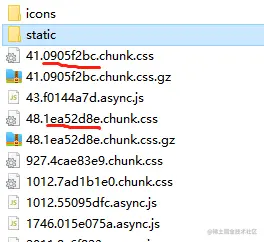

这是我打完包之后的css文件。大家是否注意到。我划了红线的部分。明显，这绝不是我的文件名。这串和乱码一样的字符串叫`哈希值`。每次打包之后都会生产一串新的`哈希值`并追加到我们的文件名中。哈希值是打包后的文件名的一部分。

我们给css设置强缓存，哪怕缓存1W年。只要我们重新打包，生产新的哈希值。那么文件名就更改了。对于机器来说，更改了文件名的文件，就是一个新的文件。

*举个例子👇*

比如，有一个css文件a1

第一次打包a1.css文件追加哈希值变成了 a1.aaaaa.css,我们给a1.aaaaa.css设置了强缓存1W年。

然后项目改动，我们又打包了一次。打包后生产新的哈希值，a1.aaaaa.css变成了a1.bbbbb.css文件。那么当我们第一次访问a1.bbbbb.css文件的时候是不会被缓存。因为1W年的缓存是给a1.aaaaa.css文件做的。关我a1.bbbbb.css文件什么事？这样我们也就能拿到最新的改动。

其他可以被webpack生成哈希值的文件同理。

**为什么index.html使用协商缓存**

既然img/css这些文件都可以用强缓存。通过更改文件名的方式来获取最新的数据，为什么我堂堂index.html就要用协商呢？

我给大家看个图

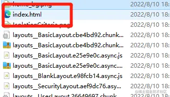

因为一般情况下，index.html是不会设置哈希值的。（具体得看自己项目下的dist文件夹）

> 注意：哈希值是需要webpack生成的。不是天生的。不过有些框架会自带（比如我使用的umi.js）,设置缓存前务必看下自己的dist文件。因为如果没有配置的话，你可能所有文件都不带哈希值。

### 7. 总结一下

- http缓存可以减少宽带流量，加快响应速度。
- 关于强缓存，`cache-control`是`Expires`的完全替代方案，在可以使用`cache-control`的情况下不要使用`expires`
- 关于协商缓存,`etag`并不是`last-modified`的完全替代方案，而是补充方案，具体用哪一个，取决于业务场景。
- 有些缓存是从磁盘读取，有些缓存是从内存读取，有什么区别？答：从内存读取的缓存更快。
- 所有带304的资源都是协商缓存，所有标注（从内存中读取/从磁盘中读取）的资源都是强缓存。


# 工具使用


## Git（玩转Git三剑客）


截图

### 1. git 的安装与配置

```bash
git --version  // 能够查看当前使用的是git的哪一个版本
```

配置user信息（配置user.name 和 user.email）

```bash
// config的三个作用域，范围越小，优先级越高 => local > global > system
git config --local //只对某个仓库有效
git config --global //对当前用户的所有仓库有效
git config --system //对系统所有登录的用户有效

// 显示当前config配置，命令加 --list
git config --list --local
git config --list --global
git config --list --system
git config --global user.name 'your_name'
git config --global user.email 'your_email@domain.com'
```


### 2. 建 Git 仓库

两种场景

1. 把已有的项目代码纳入 Git 管理

   ```bash
   cd 项目代码所在的文件夹
   git init
   ```

2. 新建的项目直接用 Git 管理

   ```bash
   cd 目标文件夹
   git init your_project //会在当前路径下创建和项目名称同名的文件夹
   cd your_project
   ```


```bash
git add -u //用于将所有已跟踪文件的修改和删除操作添加到暂存区中，但不包括新添加的文件。这个命令会更新已经被 Git 管理的文件，但不会添加新的未跟踪文件。

git reset --hard //会将工作区和暂存区中的修改全部丢弃，但是对于未被 Git 追踪的文件（即未通过git add添加到版本控制中的文件），这些文件不会受到影响，不会被删除。

git mv old_file_name new_file_name //可以给已被Git追踪的文件重命名

//可以通过 git log 命令查看 git 的提交历史
git log //默认查看当前分支的所有提交历史
git log --all //可以查看所有分支的所有提交历史
git log --all --graph //通过图形化的方式查看所有分支的所有提交历史
git log --oneline //可以查看提交历史的指针hash值 和 commit的message信息（git log是更详细的包含提交者和日期等信息的，--oneline是查看简洁的信息）
git log -n4 --oneline //通过 【-n数字X】的方式查看最新X次的提交日志，如git log -n2 --oneline是查看最新两条commit日志
git log --oneline --all -n4 --graph//图形化查看该仓库最新4次的提交历史（可能属于不同分支）
git log --oneline temp -n4 --graph//图形化查看该仓库 temp 分支最新4次的提交历史


git commit -am'commit_message' // 该命令结合了 -a 和 -m 两个选项的功能：
-a 选项表示自动将所有已跟踪文件的修改添加到暂存区中，相当于执行 git add -u。
-m 选项后面跟着的参数表示提交时的提交信息。
因此，git commit -am 命令的作用是将所有已跟踪文件的修改添加到暂存区并提交，同时指定提交信息。这个命令适用于只有修改操作，没有新添加的文件的情况。如果有新添加的文件，需要先使用 git add 命令将新文件添加到暂存区，然后再使用 git commit -m 提交。

git checkout -b branch_name target_hash_value // 创建分支名为branch_name的新分支，该分支的初始版本是target_hash_value所对应的提交节点

git branch -av //列出所有分支的详细信息，具体含义如下：
git branch 用于列出所有本地分支。
-a 选项表示显示所有分支，包括本地分支和远程分支。
-v 选项表示显示分支的详细信息，包括每个分支最后一次提交的 SHA-1 标识符和提交信息。
```


## NVM

### 一、NVM介绍

NVM：Node Version Manage，即Node的版本管理工具。使用NVM，可以很方便地在多个NodeJS版本之间进行切换。

由于项目开发当中，不同的项目可能依赖不同版本的NodeJS，这种情况下，NodeJS版本的切换将会是一件非常麻烦的事情。因此，使用NVM管理NodeJS版本就显得尤为重要。

### 二、安装NVM

##### 2.1 下载安装包

在GitHub上下载NVM的安装包。下载地址：https://github.com/coreybutler/nvm-windows/releases，选择下载nvm-setup.zip。

注：本例中选用的是截至2022年4月12日最新版本的NVM安装包，版本号为1.1.9。

##### 2.2 安装NVM

（注：安装NVM前，建议先卸载电脑上现有的NodeJS，避免冗余）

双击nvm-setup.exe文件，进行NVM的安装。

(1) 接受协议，下一步。

(2) 选择NVM的安装路径。可以按照个人习惯，自行选择安装路径。本例中，按照本人习惯，选择安装在D:\Program Files\nvm下。

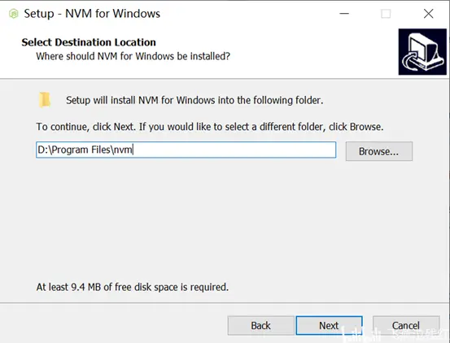

选择NVM的安装路径


(3) 选择NodeJS的Symlink (符号链接)文件夹的位置，用于生成NodeJS的映射目录。本例中，按照本人习惯，选择D:\Program Files\nodejs。

注：安装前，需确保Symlink文件夹所在的路径不存在，否则可能安装失败。

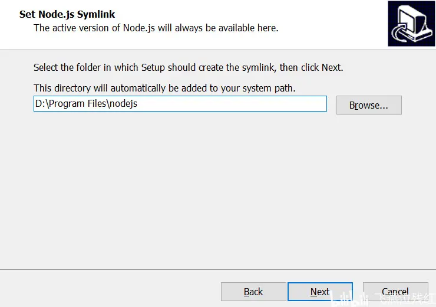

选择NodeJS的Symlink (符号链接)文件夹的位置


(4) 点击安装，等待安装完成。

(5) 配置环境变量。

打开高级系统设置->环境变量，可以发现，安装成功后，NVM已经自动帮我们配置了环境变量NVM_HOME和NVM_SYMLINK，并且配置了Path的值。

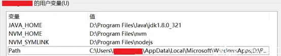

查看环境变量


因此，对于1.1.9版本的NVM，环境变量一般情况下无需手动配置。

注：若使用的是免安装版的NVM，可以按照如下方式手动配置环境变量。

\1. 在用户变量(或系统变量)中，添加变量名NVM_HOME，变量的值为NVM所在的根路径(以本例为例，路径为：D:\Program Files\nvm)； 2. 在用户变量(或系统变量)中，添加变量名NVM_SYMLINK，变量的值为NodeJS的Symlink 文件夹的位置(以本例为例，路径为：D:\Program Files\nodejs)； 3. 在用户变量(或系统变量)的path当中添加两个值：%NVM_HOME%和%NVM_SYMLINK%。

(6) 配置NodeJS下载代理镜像（可选）

安装完成后，可以在NVM安装根目录下的setting.txt文件中，配置NodeJS下载代理镜像，解决在线安装NodeJS时速度慢的问题。

注：由于下载速度一般正常，并且可以使用离线安装的方式安装NodeJS，因此配置NodeJS下载镜像地址并不是必须的。由于篇幅有限，这里不再展开介绍。

##### 2.3 验证NVM是否安装成功

安装完成后，打开命令行窗口，输入nvm -v，出现版本号即表示安装成功。

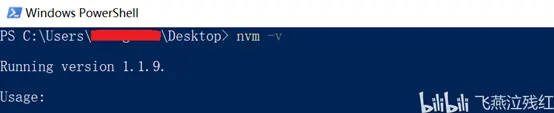

验证NVM是否安装成功


### 三、在NVM中安装NodeJS

首先，在使用NVM安装NodeJS前，需要以管理员身份打开命令行窗口。否则，将无法使用nvm use命令切换NPM版本。

##### 3.1 在线安装NodeJS

(1) 首先，使用NVM命令 nvm list available，查看可安装的NodeJS版本。建议选择LTS中的版本进行安装（LTS，即Long Term Support，长期支持版本）

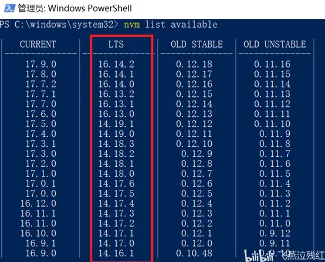

查看可安装的NodeJS版本


注：若要查看完整的可安装版本列表，可访问官网：https://nodejs.org/en/download/releases。

(2) 使用NVM命令nvm install，进行对应版本NodeJS的在线安装。

示例 ：如需在线安装16.14.2版本的NodeJS，直接在命令行窗口输入：

nvm install 16.14.2

示例 ：如需在线安装14.19.1版本的NodeJS，直接在命令行窗口输入：

nvm install 14.19.1

##### 3.2 离线安装NodeJS

(1) 从官网下载指定版本NodeJS的免安装版离线安装包，下载地址：https://nodejs.org/en/download/releases/。

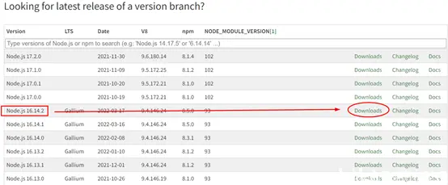

从官网下载指定版本NodeJS的免安装版离线安装包


本例中是Windows 10 64位操作系统，因此选择的是node-v16.14.2-win-x64.zip。


从官网下载指定版本NodeJS的免安装版离线安装包


(2) 将指定版本的NodeJS免安装版离线安装包，解压后放入到NVM安装路径的根目录下，即可完成离线安装。

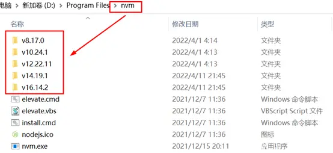

NVM中离线安装各版本NodeJS


##### 3.3 版本切换

若已经成功安装了指定版本的NodeJS，只需要在命令行窗口执行npm use命令，切换对应版本的NodeJS即可。本例中，由于已经安装了16.14.2版本，因此可以执行以下命令：

nvm use 16.14.2

若操作成功，将出现提示：Now using node v16.14.2 (64-bit)

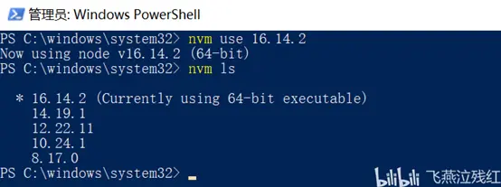

在NVM中切换指定版本的NodeJS


### 四、NVM常用命令

NVM的常用命令如下：

nvm list available：查看可在线安装的NodeJS版本

nvm ls：列出所有已经在NVM中安装的NodeJS版本。

nvm current：显示当前正在使用的Node版本。

nvm install xx.xx.xx：在NVM中在线安装指定版本的NodeJS，xx.xx.xx为指定的版本号。

nvm uninstall xx.xx.xx：在NVM中卸载指定版本的NodeJS，xx.xx.xx为指定的版本号。

nvm use xx.xx.xx：切换NodeJS版本，xx.xx.xx为指定的版本号。

nvm version：显示当前所使用的NVM的版本号。

其它命令，如nvm arch、nvm on、nvm off、nvm proxy、nvm node_mirror、nvm npm_mirror、nvm root等，由于篇幅有限，这里不再展开介绍。

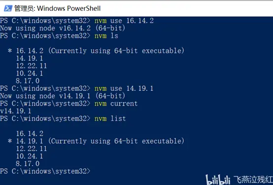


# 历史

## 得到

主推课程学习，知识付费，专业老师系统的讲述一门课程，一些很有实力的老师可以深入浅出的将一系列复杂问题，从原理上面讲的透彻，思想贯穿整个课程，着重推荐几个大V：李笑来，薛兆丰，香帅，严伯钧


## 云听

### 百家讲坛

易中天、袁腾飞、纪连海、曾仕强


日记：

2024.08.14

每天想着下班回家玩，其实是在虚度光阴，时间是很短暂的，已经过去了快28年，珍惜时间，珍惜当下。
