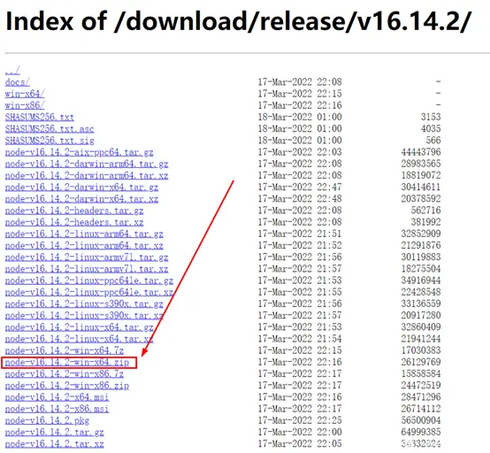

# 工具使用

## NVM

### 一、NVM介绍

NVM：Node Version Manage，即Node的版本管理工具。使用NVM，可以很方便地在多个NodeJS版本之间进行切换。

由于项目开发当中，不同的项目可能依赖不同版本的NodeJS，这种情况下，NodeJS版本的切换将会是一件非常麻烦的事情。因此，使用NVM管理NodeJS版本就显得尤为重要。

### 二、安装NVM

##### 2.1 下载安装包

在GitHub上下载NVM的安装包。下载地址：https://github.com/coreybutler/nvm-windows/releases，选择下载nvm-setup.zip。

注：本例中选用的是截至2022年4月12日最新版本的NVM安装包，版本号为1.1.9。

##### 2.2 安装NVM

（注：安装NVM前，建议先卸载电脑上现有的NodeJS，避免冗余）

双击nvm-setup.exe文件，进行NVM的安装。

(1) 接受协议，下一步。

(2) 选择NVM的安装路径。可以按照个人习惯，自行选择安装路径。本例中，按照本人习惯，选择安装在D:\Program Files\nvm下。

选择NVM的安装路径

(3) 选择NodeJS的Symlink (符号链接)文件夹的位置，用于生成NodeJS的映射目录。本例中，按照本人习惯，选择D:\Program Files\nodejs。

注：安装前，需确保Symlink文件夹所在的路径不存在，否则可能安装失败。

选择NodeJS的Symlink (符号链接)文件夹的位置

(4) 点击安装，等待安装完成。

(5) 配置环境变量。

打开高级系统设置->环境变量，可以发现，安装成功后，NVM已经自动帮我们配置了环境变量NVM_HOME和NVM_SYMLINK，并且配置了Path的值。

查看环境变量

因此，对于1.1.9版本的NVM，环境变量一般情况下无需手动配置。

注：若使用的是免安装版的NVM，可以按照如下方式手动配置环境变量。

\1. 在用户变量(或系统变量)中，添加变量名NVM_HOME，变量的值为NVM所在的根路径(以本例为例，路径为：D:\Program Files\nvm)； 2. 在用户变量(或系统变量)中，添加变量名NVM_SYMLINK，变量的值为NodeJS的Symlink 文件夹的位置(以本例为例，路径为：D:\Program Files\nodejs)； 3. 在用户变量(或系统变量)的path当中添加两个值：%NVM_HOME%和%NVM_SYMLINK%。

(6) 配置NodeJS下载代理镜像（可选）

安装完成后，可以在NVM安装根目录下的setting.txt文件中，配置NodeJS下载代理镜像，解决在线安装NodeJS时速度慢的问题。

注：由于下载速度一般正常，并且可以使用离线安装的方式安装NodeJS，因此配置NodeJS下载镜像地址并不是必须的。由于篇幅有限，这里不再展开介绍。

##### 2.3 验证NVM是否安装成功

安装完成后，打开命令行窗口，输入nvm -v，出现版本号即表示安装成功。

验证NVM是否安装成功

### 三、在NVM中安装NodeJS

首先，在使用NVM安装NodeJS前，需要以管理员身份打开命令行窗口。否则，将无法使用nvm use命令切换NPM版本。

##### 3.1 在线安装NodeJS

(1) 首先，使用NVM命令 nvm list available，查看可安装的NodeJS版本。建议选择LTS中的版本进行安装（LTS，即Long Term Support，长期支持版本）

查看可安装的NodeJS版本

注：若要查看完整的可安装版本列表，可访问官网：https://nodejs.org/en/download/releases。

(2) 使用NVM命令nvm install，进行对应版本NodeJS的在线安装。

示例 ：如需在线安装16.14.2版本的NodeJS，直接在命令行窗口输入：

nvm install 16.14.2

示例 ：如需在线安装14.19.1版本的NodeJS，直接在命令行窗口输入：

nvm install 14.19.1

##### 3.2 离线安装NodeJS

(1) 从官网下载指定版本NodeJS的免安装版离线安装包，下载地址：https://nodejs.org/en/download/releases/。

从官网下载指定版本NodeJS的免安装版离线安装包

本例中是Windows 10 64位操作系统，因此选择的是node-v16.14.2-win-x64.zip。

从官网下载指定版本NodeJS的免安装版离线安装包

(2) 将指定版本的NodeJS免安装版离线安装包，解压后放入到NVM安装路径的根目录下，即可完成离线安装。

NVM中离线安装各版本NodeJS

##### 3.3 版本切换

若已经成功安装了指定版本的NodeJS，只需要在命令行窗口执行npm use命令，切换对应版本的NodeJS即可。本例中，由于已经安装了16.14.2版本，因此可以执行以下命令：

nvm use 16.14.2

若操作成功，将出现提示：Now using node v16.14.2 (64-bit)

在NVM中切换指定版本的NodeJS

### 四、NVM常用命令

NVM的常用命令如下：

nvm list available：查看可在线安装的NodeJS版本

nvm ls：列出所有已经在NVM中安装的NodeJS版本。

nvm current：显示当前正在使用的Node版本。

nvm install xx.xx.xx：在NVM中在线安装指定版本的NodeJS，xx.xx.xx为指定的版本号。

nvm uninstall xx.xx.xx：在NVM中卸载指定版本的NodeJS，xx.xx.xx为指定的版本号。

nvm use xx.xx.xx：切换NodeJS版本，xx.xx.xx为指定的版本号。

nvm version：显示当前所使用的NVM的版本号。

其它命令，如nvm arch、nvm on、nvm off、nvm proxy、nvm node_mirror、nvm npm_mirror、nvm root等，由于篇幅有限，这里不再展开介绍。

