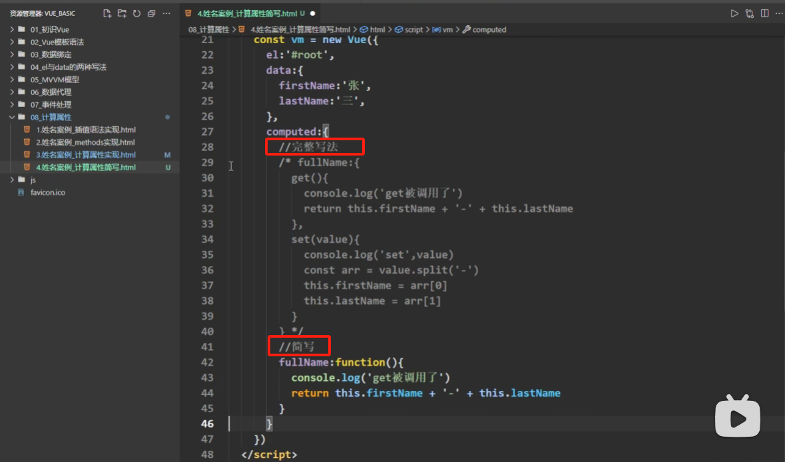
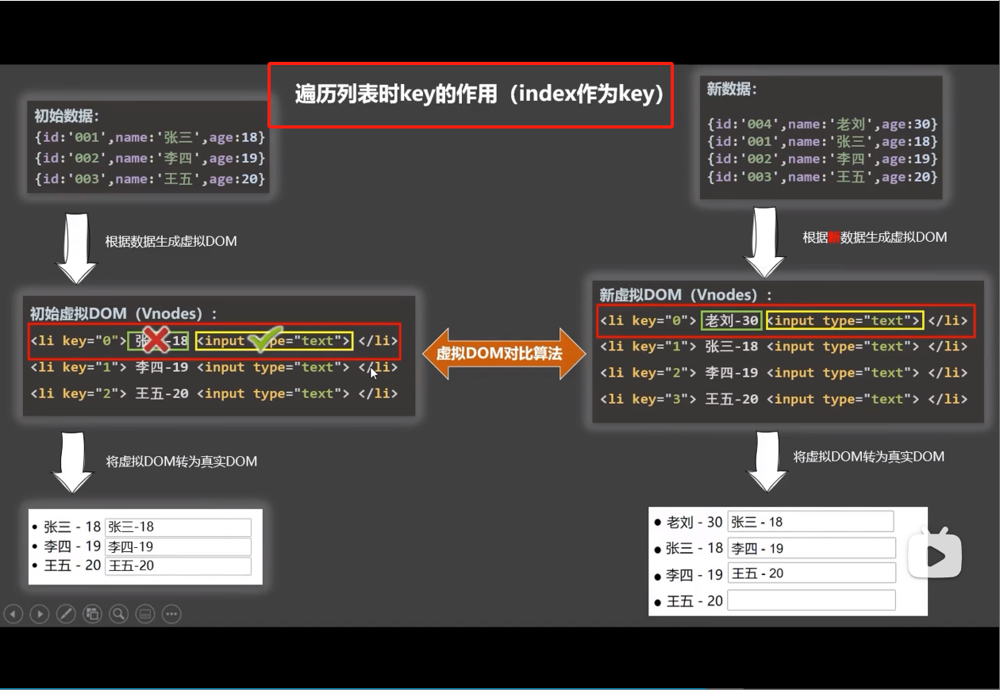
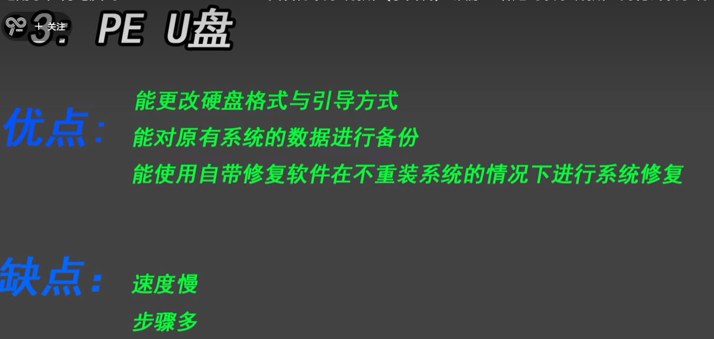
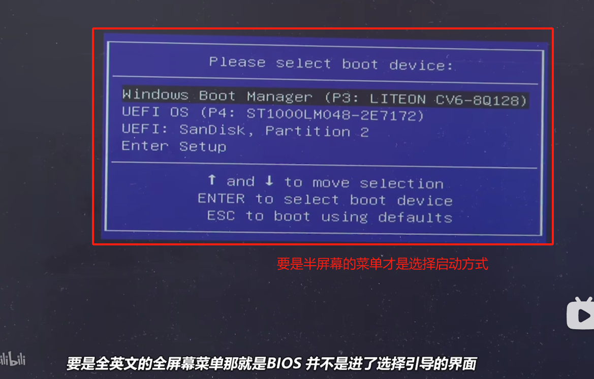

# Vue

### 1.VsCode插件安装

1. Vue 3 Snippets

Vue实例中所有带**"$"**符号的都是Vue为程序员准备的变量，所有不带$符号的都是底层在使用的变量


### 2.el 和 data的两种写法

+ el有两种写法：
  + new Vue的时候配置el属性
  + 先创建Vue实例，然后通过vm.$mount('#root')指定el的值

+ data的两种写法：
  + 对象式
  + 函数式（组件必须使用函数式，否则会报错）


### 3.defineProperty数据代理

通过一个对象代理对另一个对象中属性的操作（读、写）    -------------这边涉及到【数据劫持】，什么是数据劫持


### 4.事件修饰符

（修饰符可以连续写： .stop.prevent）

1. .prevent      =>   event.preventDafault(阻止默认行为，比如a标签的跳转行为)

2. .stop 阻止事件冒泡

3. .once 事件只触发一次

4. .capture 使用事件的捕获模式

5. .self 只有event.target 是当前操作的元素时才触发事件

6. .passive 时间的默认行为立即执行，无需等待事件回调执行完毕

   比如@wheel事件发生时（鼠标滚轮滚动时）会先执行对应的回调函数，再移动滚动条。如果回调函数执行时间较长滚动条就会暂时不移动，有一种卡顿住的感觉，此时使用@wheel.passive就能解决该问题，该修饰符常用在配合移动端的应用时


  

### 5.键盘事件

@keydown 按键按下的时候触发、@keyup按键按下抬起的时候触发（可以连续写： @keydown.ctrl.y => 需要输入【ctrl+y】才会触发）

1. **Vue中常用的按键别名：**

   + 回车 => enter
   + 删除 => delete（捕获”删除Delete“或者”退格Backspace“键）
   + 退出 => esc
   + 空格 => space
   + 换行 => tab（**特殊，必须配合keydown，不然点击tab不起作用且直接跳转到下一个可聚焦的元素上**）
   + 上 => up
   + 下 => down
   + 左 => left
   + 右 => right 
2. Vue未提供别名的按键，可以使用按键**原始的key值(监听keyup事件输出event.key)**去绑定，但注意要转为kebab-case（短横线命名，如CapsLock => @keyup.caps-lock）
3. 比上面**Tab键**更特殊的系统修饰键（用法特殊）：**ctrl、alt、shift、meta（即电脑的windows键）**
   + 配合keyup使用：按下修饰键的同时，再按下其他按键，随后释放其他键，事件才被触发
   + **配合keydown使用：直接使用即可，可以正常触发事件**
4. Vue.config.keyCodes.自定义键名 = 键码，可以去定制按键别名


### 6.计算属性computed

1.  定义：要用的属性不存在，要通过Vue实例中data已有的属性去计算得来，计算属性最终会出现在Vue实例上，直接读取即可，不能通过调用方法【如fullName.get()】的形式；
2. 原理：底层借助了Object.defineProperty方法提供的getter和setter；
3. get函数什么时候执行：
   + 初次读取该计算属性的时候会执行一次（重复执行时不会再调用了）
   + 当依赖的数据发生改变时会再次执行
4. 与method相比的优势：内部有缓存机制（可以实现复用），效率更高，在Vue的开发者工具中能看到所有的计算属性，调试更方便；
5. 备注：如果计算属性要被修改，那就必须写set函数去响应修改，且set中要引起该计算属性计算时所依赖的数据发生改变，才能引起getter的改变。不过一般情况下计算属性只需要getter，此时可以用计算属性的简写形式。

 





### 7.监视属性watch

1. 当监视属性变化时，回调函数自动调用；监视的属性必须存在才能进行监视，否则写了没意义

2. 监视的两种写法：

   + 通过new Vue时的watch配置

   + 通过vm.$watch监视

     

3. 深度监视

   + Vue中的watch默认不监测对象内部值的改变，只能监测到data下的第一层属性；配置 **deep:true** 可以监测对象内部值的改变（可以实现监听到data下有多层级的对象属性）

   + Vue自身可以监测对象内部值的改变（如从改了内部值number.a后，界面上展示number.a的数据对应更新可知），但Vue提供的watch默认不可以

   + 使用watch时根据数据的具体结构决定是否采用深度监视

     

4. 简写形式（当不需要配置 **immediate** 和 **deep** 的时候可以用简写的形式）：

   

5. **和computed的比较：**

   + computed能完成的功能，watch都可以完成，**首选用computed实现**
   + watch能完成的功能，computed不一定能完成，例如watch可以进行异步操作，computed就不行
   + 两个重要的小原则：
     + 所有被Vue管理的函数（如computed、watch、methods等）最好写成普通函数，这样this的指向才是vm或组件实例对象；
     + 所有不被Vue所管理的函数（如定时器的回调函数、ajax的回调函数、Promise的回调函数）最好写成箭头函数，这样this的指向才是vm或组件实例对象


### 8.绑定样式（:class、:style）

1. class样式写法  **:class="xxx"**,xxx可以是字符串、对象、数组
   + 字符串适用于类名不确定，要动态获取（指定一个类名）
   + 对象写法适用于：要绑定多个样式，个数确定、名字也确定，但要动态决定用不用（通过属性值true或者false来启用停用）
   + 数组写法适用于：要绑定多个样式，个数不确定，类名也不确定，要新增class类就直接push进去即可


### 9.列表循环指令 v-for

用于展示数据，可遍历数组、对象、字符串（类似数组）、指定次数（例如：v-for="item in 5"）

+ key的作用和原理：key是虚拟DOM对象的标识，当状态中的数据发生变化的时候，Vue会根据【新数据】生成【新的虚拟DOM】，随后Vue进行【新的虚拟DOM】与【旧的虚拟DOM】的差异比较。

+ 比较规则如下：

  + 旧的虚拟DOM中找到了与新的虚拟DOM相同的key：

    + 若虚拟DOM中的内容没变，**直接使用之前的真实DOM**
    + 若虚拟DOM中内容变了，则生成新的真实DOM，随后替代掉页面中之前的真实DOM

  + 旧的虚拟DOM中未找到与新的虚拟DOM相同的key则创建新的真实DOM，随后渲染到页面上。

  + index作为key（不写key时默认将index作为key）：

    可能引发的问题：

    + 若对数据进行逆序添加、逆序删除等破坏顺序的操作，会产生没有必要的真实DOM更新 => 界面效果没问题，但效率低
    + 如果结构中还包含输入类的DOM，则会产生错误的DOM更新 => 界面有问题

    

    

  + id作为key（首选，要使用每条数据的唯一标识作为key）：

    


### 10.Vue监视数据的原理

1. Vue会监视data中所有层次的数据（无论对象有几个层级）
2. 如何检测对象中的数据：
   + 通过setter实现监视，且要在new Vue时就传入要监测的数据
   + 对象中后追加的属性，Vue默认不做响应式处理，如需给后追加的属性做响应式，则使用如下API：
     + Vue.set( target, propertyName/ArrayIndex, value)
     + Vue实例对象vm.$set( target, propertyName/ArrayIndex, value)
3. 如何监测数组中的数据：
   + 通过包裹数组更新元素的方法实现，在Vue修改数组中的某个元素一定要用可以改变原数组的方法：**push、pop、shift、unshift、reverse、sort、splice**，调用方法本质就是做了如下两件事：
     + 调用原生对应的数组方法对数组进行更新
     + 重新解析模板，进而更新页面
   + 使用如上2中的监测对象方法Vue.set()、vm.$set()也可以修改Vue数组数据
4. 特别注意：**Vue.set()和vm.$set() 不能给vm或vm的根数据对象（即vm._data属性）添加属性**，否则控制台会直接报错。


### 11.v-model收集表单数据

1. 若<input type="text" />，则v-model收集的是用户输入的value值；
2. 若<input type="radio" />，v-model收集的是value值，所以要给标签配置value值；
3. 若<input type="checkbox" />，如果没有配置value属性，则v-model收集的就是checked（布尔值，即是否勾选上）；如果有配置value属性：
   + v-model的初始值是非数组，则v-model收集的依旧是checked；
   + v-model的初始值是数组，则v-model收集的就是value组成的数组
4. v-model的三个修饰符：
   + lazy：失去焦点时再收集数据
   + number：输入字符串转为有效的数字，通常和input的type=“number”联合使用；
   + trim：会过滤掉输入的首尾空格


### 12.过滤器 filter

+ 定义：对要显示的数据进行特定格式化后再显示（适用于一些简单逻辑的处理）
+ 语法：
  + 注册过滤器：Vue.filter(name, callback) 或 new Vue({ filters: {}})
  + 使用过滤器： {{xxx | 过滤器名}} 或 v-bind:属性="xxx | 过滤器名"
+ 备注：
  + 过滤器可以接受额外参数，多个过滤器也可以串联
  + 并没有改变原本的数据，是产生新的格式化数据用于展示

+ 局部过滤器

+ 全局过滤器

  ```js
  Vue.filter('myFilter', function(value){
    return value.slice(0, 4)
  })
  ```


### 13.内置指令

1. v-text：作用是向其所在的节点中渲染文本内容，与{{}}插值语法的区别是v-text会替换掉节点中的内容，插值语法不会；

2. v-html：作用是向指定节点中渲染包含html结构的内容，与插值语法的区别是v-html会替换掉节点中的所有内容，而插值语法不会，且v-html可以识别html结构。**严重注意：**v-html有安全性问题！！！在网站上动态渲染任意HTML是非常危险的，容易导致XSS攻击，一定要在可信的内容上使用v-html，永远不要用在用户提交的内容上！

   

3. v-clock指令（无需赋值）：本质是一个特殊的属性，Vue实例创建完毕并接管容器后，会删掉v-clock属性，使用CSS（如：【v-clock】{display：none}）配合v-clock可以解决网速慢时页面展示出源代码{{xxx}}的问题

4. v-once：所在的节点在初次动态渲染后，就视为静态内容了，以后数据的改变不会引起v-once所在结构的更新，可以用于优化性能

5. v-pre：跳过其所在节点的编译过程，可利用他跳过没有使用指令语法、没有使用插值语法的节点，会加快编译


### 14.自定义指令 directive

需求1：定义一个v-big指令，和v-text功能类似，但会把绑定的数值放大10倍；

需求2：定义一个v-fbind指令，和v-bind功能类似，但可以让其所绑定的input元素默认获取焦点；

1. 定义语法：

   + 局部指令：

     ```js
     new Vue({
       directives: {
         指令名： 配置对象/回调函数
       }
     })
     例：
     <span v-big="num"></span>
     <input type="text" v-fbind="num" />
     
     new Vue({
       directives: {
         big(element, binding) {
             element.innerText = binding.value * 10
         },
         fbind: {
           // 指令与元素成功绑定时调用
     	  bind(element, binding){
     		element.value = binding.value
     	  },
           // 指令所在元素被插入到页面时调用
     	  inserted(element, binding){
     		element.focus()
     	  },
           // 指令所在模板结构被重新解析时调用
     	  update(element, binding){
             element.value = binding.value
           }
     	}
       }
     })
     ```

   + 全局指令：

     ```js
     Vue.directive(指令名， 配置对象/回调函数)
     例：
     <span v-big="num"></span>
     <input type="text" v-fbind="num" />
         
     Vue.directive('big', function(element, binding){
         element.innerText = binding.value
     })
     Vue.directive('fbind', {
         bind(element,binding) {
             element.value = binding.value
         },
         inserted(element, binding){
             element.focus()
         },
         update(element, binding){
             element.value = binding.value
         }
     })
     ```

2. 配置对象中的三个回调：

   + bind：指令与元素成功绑定时调用
   + inserted：指令所在元素被插入页面时调用（插入页面后才会有对应的dom节点和父节点等等，对应的如element.focus等操作使用才有效果）
   + update：指令所在模板结构被重新解析时调用

3. 备注：

   + 指令在定义的时候不用加 **v- **，但在使用的时候要加  **v-**
   + 指令名如果是多个单词，要使用kebab-case命名方式，不要用camelCase命名（如指令v-big-number不能写成v-bigNumber）


### 15.生命周期

又名生命周期回调函数、生命周期函数、生命周期钩子，生命周期函数中的this指向是vm或组件实例对象

+ 常用的生命周期钩子：
  + mounted：发送ajax请求、启动定时器、绑定自定义事件、订阅消息等【初始化操作】
  + beforeDestroy：清除定时器、解绑自定义事件、取消订阅消息等【收尾工作】
+ 关于销毁Vue实例：
  + 销毁后杰出Vue开发者工作看不到任何消息
  + 销毁后自定义事件会失效，但原生DOM事件依然有效
  + 一般不会在beforeDestroy操作数据，因为即便操作数据也不会再触发更新流程了


### 16.组件化编程

+ 非单文件组件：一个文件中包含有n个组件

  

+ 单文件组件：一个文件中只包含1个组件


**Vue使用组件的三大步骤：**

+ 定义组件（创建组件）
  + 使用**Vue.extend(options) **创建，其中options和new Vue(options)时传入的那个options几乎一样，但也有点区别，区别如下：
    + el不要写，最终所有的组件都要经过一个vm的管理，由vm中的el决定使用哪个容器
    + data必须写成函数，这样组件复用的时候得到的data对象是一个全新的对象，不会被对象的引用关系影响数据
+ 注册组件
  + 局部注册：靠new Vue的时候引入components选项
  + 全局注册：靠Vue.component('组件名', 组件)
+ 使用组件（写组件标签）


几个注意点：

+ 关于组件名：
  + 一个单词组成：全小写（如：school）或者首字母大写（如：School）
  + 多个单词组成：
    + kebab-case命名：my-school
    + CamelCase命名：MySchool（需要Vue脚手架支持）
  + 备注：可以使用name配置项指定组件在Vue devtools开发者工具中呈现的名字
+ 关于组件标签：
  + 第一种写法：<school></school>
  + 第二种写法：<school /> 不使用脚手架时，<school />会导致后续组件不能渲染
+ 简写方式： const school = Vue.extend(options) 可简写为 const school = options
+ 关于VueComponent：
  + school组件本质是一个名为VueComponent的构造函数，且不是程序员定义的，而是Vue.extend生成的
  + vc不能写el配置项，data要配置成函数形式，不能用对象形式
  + 我们只需要写<school />或<school></school>，Vue解析时就会帮我们创建school组件的实例对象，即Vue帮我们执行的new VueComponent(options)
  + 特别注意：每次调用Vue.extend，返回的都是一个全新的VueComponent构造函数
  + 关于this指向
    + 组件配置中，data函数、methods、watch、computed等中的函数，它们的this均是【VueComponent实例对象】
    + new Vue(options)配置中，data函数、methods、watch、computed等中的函数，它们的this均是【Vue实例对象】

  + VueComponent的实例对象以后简称vc（或称为：组件实例对象），Vue的实例对象简称为vm


**一个重要的内置关系：** **VueComponent.prototype.\__proto__ === Vue.prototype**，让组件实例对象（vc）可以访问到Vue原型上的属性、方法。


### 17.单文件组件


**脚手架文件结构**

	├── node_modules 
	├── public
	│   ├── favicon.ico: 页签图标
	│   └── index.html: 主页面
	├── src
	│   ├── assets: 存放静态资源
	│   │   └── logo.png
	│   │── component: 存放组件
	│   │   └── HelloWorld.vue
	│   │── App.vue: 汇总所有组件
	│   │── main.js: 入口文件
	├── .gitignore: git版本管制忽略的配置
	├── babel.config.js: babel的配置文件
	├── package.json: 应用包配置文件 
	├── README.md: 应用描述文件
	├── package-lock.json：包版本控制文件


**关于不同版本的Vue：**

+ vue.js与vue.runtime.xxx.js的区别：

  + vue.js是完整版的Vue，包含：核心功能+模板解析器
  + vue.runtime.xxx.js是运行版的Vue，只包含：核心功能，没有模板解析器

+ 因为vue.runtime.xxx.js没有模板解析器，所以不能使用template配置项，需要使用render函数接收到的createElement函数去指定具体内容：

  ```js
  new Vue({
      render: h => h(APP)
  }).$mount("#app")
  ```

  

**vue.config.js配置文件**

1. 使用vue inspect > output.js可以查看到Vue脚手架的默认配置。
2. 使用vue.config.js可以对脚手架进行个性化定制，详情见：https://cli.vuejs.org/zh


#### （1）ref属性

+ ref属性被用来给元素或子组件注册引用信息（id的替代者），当应用在html标签上时，获取的是真实DOM元素，当应用在组件标签上时获取的是组件实例对象（vc）

+ 使用方式：

  + 打标识：

    ```vue
    <h1 ref="xxx">......</h1>
    <School ref="xxx"></School>
    ```

  + 获取： this.$refs.xxx


#### （2）props配置

功能：让组件接收外部传过来的数据

+ 传递数据：<Student name="kangkang">

+ 接收数据：

  + 只接收数据： props: ["name"]

  + 限制类型： props: { name: String }

  + 限制类型+限制必要性+指定默认值：

    ```js
    props: {
        name: {
            type: String,
            required: true,
            default: 'kangkang'
        }
    }
    ```

+ 备注：**props是只读的。**Vue底层会监测你对props的修改，如果进行了修改，就会发出警告，若业务需求确实需要修改，则可以通过复制props的内容到data中，然后去操作data中的数据


#### （3）mixin混入配置

功能：可以把多个组件共用的配置提取成一个混入对象，然后在组件局部引入或在main.js中全局引入实现复用配置的效果。

**注意：如果混入的data、methods中的数据和组件中定义的重名，则以组件定义的值为准；如果混入的是生命周期函数，则组件定义的和混入的生命周期函数都会执行**

使用方式：

+ 定义混入：

  ```js
  {
      data(){},
      methods:{
          ......
      },
      created(){......}
  }
  ```

+ 使用混入：

  + 全局混入：

    ```js
    //在main.js中引入并调用Vue.mixin
    import {myMixin} from './mixin'
    Vue.mixin(myMixin)
    ```

  + 局部混入：

    ```vue
    import {myMixin} from './mixin'
    通过在组件中直接配置mixins属性
    data(){
      return {......}
    },
    mixins: [myMixin]
    ```

#### （4）插件

+ 功能：用于增强Vue

+ 本质：包含一个install方法的对象，install的第一个参数是Vue的构造函数，第二个以后的参数是插件使用者在调用Vue.use(pluginName,...)中传递的其他参数

+ 定义插件：

  ```js
  对象.install = function(Vue, options) {
      // 1.添加全局过滤器
      Vue.filter(......)
                 
      // 2.添加全局指令
      Vue.directive(......)
      
      // 3.配置全局混入
      Vue.mixin(......)
                
      // 4.添加实例方法
      Vue.prototype.$myMethod = function(){......}
  }
  ```

+ 使用插件： **Vue.use(pluginName)**


#### （5）总结TodoList案例

1. 组件化编码流程：

   + 拆分静态组件：组件要按照功能点拆分，命名不要与html元素冲突。

   + 实现动态组件：考虑好数据的存放位置，数据是一个组件在用，还是一些组件在用：
     + 一个组件在用：放在组件自身即可。
     + 一些组件在用：放在他们共同的父组件上（<span style="color:red">状态提升</span>）。

2. props适用于：

   + 父组件 ==> 子组件 通信
   + 子组件 ==> 父组件 通信（要求父先给子一个函数）

3. 使用v-model时要切记：v-model绑定的值不能是props传过来的值，因为props是不可以修改的！

4. props传过来的若是对象类型的值，修改对象中的属性时Vue不会报错，但不推荐这样做。


#### （6）webStorage

1. 存储内容大小一般支持5MB左右（不同浏览器可能还不一样）

2. 浏览器端通过 Window.sessionStorage 和 Window.localStorage 属性来实现本地存储机制。

3. 相关API：

   1. ```xxxxxStorage.setItem('key', 'value');```
      	该方法接受一个键和值作为参数，会把键值对添加到存储中，如果键名存在，则更新其对应的值。

   2. ```xxxxxStorage.getItem('person');```

      ​		该方法接受一个键名作为参数，返回键名对应的值。

   3. ```xxxxxStorage.removeItem('key');```

      ​		该方法接受一个键名作为参数，并把该键名从存储中删除。

   4. ``` xxxxxStorage.clear()```

      ​		该方法会清空存储中的所有数据。

4. 备注：

   1. SessionStorage存储的内容会随着浏览器窗口关闭而消失。
   2. LocalStorage存储的内容，需要手动清除（代码清除或者清楚浏览器缓存）才会消失。
   3. ```xxxxxStorage.getItem(xxx)```如果xxx对应的value获取不到，那么getItem的返回值是null。
   4. ```JSON.parse(null)```的结果依然是null。


#### （7）组件的自定义事件

1. 一种组件间通信的方式，适用于：<strong style="color:red">子组件 ===> 父组件</strong>

2. 使用场景：A是父组件，B是子组件，B想给A传数据，那么就要在A中给B绑定自定义事件（<span style="color:red">在B中触发事件，然后在A中执行事件的回调函数</span>）。

3. 绑定自定义事件：

   1. 第一种方式，在父组件中：```<Demo @atguigu="test"/>```  或 ```<Demo v-on:atguigu="test"/>```

   2. 第二种方式，在父组件中：

      ```js
      <Demo ref="demo"/>
      ......
      mounted(){
      this.$refs.demo.$on('atguigu',this.test)
      }
      ```

   3. 若想让自定义事件只能触发一次，可以使用```.once```修饰符，或```$once```方法。

4. 触发自定义事件：```this.$emit('atguigu',数据)```		

5. 解绑自定义事件

   ```js
   this.$off('atguigu') // 解绑一个事件
   this.$off(['atguigu', 'func2']) // 解绑多个事件
   this.$off() //解绑所有事件
   ```

6. 组件上也可以绑定原生DOM事件，需要使用```native```修饰符。

   ```vue
   // 错误，click会被当成自定义事件
   <Demo ref="demo" @click="handleClick"/>
   
   //正确
   <Demo ref="demo" @click.native="handleClick"/>
   ```

7. 注意：通过```this.$refs.xxx.$on('atguigu',回调)```绑定自定义事件时，回调<span style="color:red">要么配置在methods中</span>，<span style="color:red">要么用箭头函数</span>，否则this指向会出问题！


#### （8）全局事件总线（GlobalEventBus）

1. 一种组件间通信的方式，适用于<span style="color:red">任意组件间通信</span>。

2. 安装全局事件总线：

   ```js
   new Vue({
   	......
   	beforeCreate() {
   		Vue.prototype.$bus = this //安装全局事件总线，$bus就是当前应用的vm
   	},
       ......
   }) 
   ```

3. 使用事件总线：

   1. 接收数据：A组件想接收数据，则在A组件中给$bus绑定自定义事件，事件的<span style="color:red">回调留在A组件自身。</span>

      ```js
      methods(){
        demo(data){......}
      }
      ......
      mounted() {
        this.$bus.$on('xxxx',this.demo)
      }
      ```

   2. 提供数据：```this.$bus.$emit('xxxx',数据)```

4. 最好在beforeDestroy钩子中，用$off去解绑<span style="color:red">当前组件所用到的</span>事件。


#### （9）消息订阅与发布（pubsub）

1. 一种组件间通信的方式，适用于<span style="color:red">任意组件间通信</span>。

2. 使用步骤：

   1. 安装pubsub：```npm i pubsub-js```

   2. 引入: ```import pubsub from 'pubsub-js'```

   3. 接收数据：A组件想接收数据，则在A组件中订阅消息，订阅的<span style="color:red">回调留在A组件自身。</span>

      ```js
      methods(){
        demo(data){......}
      }
      ......
      mounted() {
        this.pid = pubsub.subscribe('xxx',this.demo) //订阅消息
      }
      ```

   4. 提供数据：```pubsub.publish('xxx',数据)```

   5. 最好在beforeDestroy钩子中，用```PubSub.unsubscribe(pid)```去<span style="color:red">取消订阅。</span>

### 18,$nextTick

1. 语法：```this.$nextTick(回调函数)```
2. 作用：在下一次 DOM 更新结束后执行其指定的回调。
3. 什么时候用：当改变数据后，要基于更新后的新DOM进行某些操作时，要在nextTick所指定的回调函数中执行。

### 19.Vue封装的过度与动画

1. 作用：在插入、更新或移除 DOM元素时，在合适的时候给元素添加样式类名。

2. 图示：

3. 写法：

   1. 准备好样式：

      - 元素进入的样式：
        1. v-enter：进入的起点
        2. v-enter-active：进入过程中
        3. v-enter-to：进入的终点
      - 元素离开的样式：
        1. v-leave：离开的起点
        2. v-leave-active：离开过程中
        3. v-leave-to：离开的终点

   2. 使用```<transition>```包裹要过渡的元素，并配置name属性：

      ```vue
      <transition name="hello">
      	<h1 v-show="isShow">你好啊！</h1>
      </transition>
      ```

   3. 备注：若有多个元素需要过渡，则需要使用：```<transition-group>```，且每个元素都要指定```key```值。

### 20.Vue脚手架配置代理

##### 方法一：

在vue.config.js中添加如下配置：

```js
devServer: {
    proxy: 'http://localhost:5000'
}
```

说明：

+ 优点：配置简单，请求资源时直接发给前端即可（如当前Vue项目启动在8080端口则接口就发给8080）
+ 缺点：不能配置多个代理，且不能灵活地控制请求是否走代理（当请求了前端项目本身存在的资源时，则直接匹配前端资源，只有在请求不存在的资源时，请求才会转发给服务器）


##### 方法二：

编写vue.config.js配置具体代理规则：

```js
module.export = {
    devServer: {
        proxy: {
            // 匹配所有以“/api1”开头的请求路径
            '/api1': {
                target: "http://localhost:5000", // 代理目标的基础路径
                changeOrigin: true,
                pathRewrite: {
                    '^/api1': ''
                }
            },
            // 匹配所有以/api2开头的请求路径
            '/api2': {
                target: 'http://localhost:5001',
                changeOrigin: true,
                pathRewrite: {
                    '^/api2': ''
                }
            }
        }
    }
}

/* 
    changeOrigin设置为true时，服务器收到的请求头中的host为：localhost:5000
    changeOrigin设置为false时，服务器收到的请求头中的host为：localhost:8080
    changeOrigin 
*/
```

说明：

+ 优点：可以配置多个代理，且可以灵活地控制请求是否走代理
+ 缺点：配置略微繁琐，请求资源必须加前缀


### 21.插槽

1. 作用：让父组件可以向子组件指定位置插入html结构，也是一种组件间通信的方式，适用于 <strong style="color:red">父组件 ===> 子组件</strong> 。

2. 分类：默认插槽、具名插槽、作用域插槽

3. 使用方式：

   1. 默认插槽：

      ```vue
      父组件中：
              <Category>
                 <div>html结构1</div>
              </Category>
      子组件中：
              <template>
                  <div>
                     <!-- 定义插槽 -->
                     <slot>插槽默认内容...</slot>
                  </div>
              </template>
      ```

   2. 具名插槽：

      ```vue
      父组件中：
              <Category>
                  <template slot="center">
                    <div>html结构1</div>
                  </template>
      
                  <template v-slot:footer>
                     <div>html结构2</div>
                  </template>
              </Category>
      子组件中：
              <template>
                  <div>
                     <!-- 定义插槽 -->
                     <slot name="center">插槽默认内容...</slot>
                     <slot name="footer">插槽默认内容...</slot>
                  </div>
              </template>
      ```

   3. 作用域插槽：

      1. 理解：<span style="color:red">数据在组件的自身，但根据数据生成的结构需要组件的使用者来决定。</span>（games数据在Category组件中，但使用数据所遍历出来的结构由App组件决定）

      2. 具体编码：

         ```vue
         父组件中：
         		<Category>
         			<template scope="scopeData">
         				<!-- 生成的是ul列表 -->
         				<ul>
         					<li v-for="g in scopeData.games" :key="g">{{g}}</li>
         				</ul>
         			</template>
         		</Category>
         
         		<Category>
         			<template slot-scope="scopeData">
         				<!-- 生成的是h4标题 -->
         				<h4 v-for="g in scopeData.games" :key="g">{{g}}</h4>
         			</template>
         		</Category>
         子组件中：
                 <template>
                     <div>
                         <slot :games="games"></slot>
                     </div>
                 </template>
         		
                 <script>
                     export default {
                         name:'Category',
                         props:['title'],
                         //数据在子组件自身
                         data() {
                             return {
                                 games:['红色警戒','穿越火线','劲舞团','超级玛丽']
                             }
                         },
                     }
                 </script>
         ```


### 22.Vuex


#### （1）概念

​		在Vue中实现集中式状态（数据）管理的一个Vue插件，对vue应用中多个组件的共享状态进行集中式的管理（读/写），也是一种组件间通信的方式，且适用于任意组件间通信。

#### （2）何时使用？

​		多个组件需要共享数据时

#### （3）搭建vuex环境

1. 创建文件：```src/store/index.js```

   ```js
   //引入Vue核心库
   import Vue from 'vue'
   //引入Vuex
   import Vuex from 'vuex'
   //应用Vuex插件
   Vue.use(Vuex)
   
   //准备actions对象——响应组件中用户的动作
   const actions = {}
   //准备mutations对象——修改state中的数据
   const mutations = {}
   //准备state对象——保存具体的数据
   const state = {}
   
   //创建并暴露store
   export default new Vuex.Store({
   	actions,
   	mutations,
   	state
   })
   ```

2. 在```main.js```中创建vm时传入```store```配置项

   ```js
   ......
   //引入store
   import store from './store'
   ......
   
   //创建vm
   new Vue({
   	el:'#app',
   	render: h => h(App),
   	store
   })
   ```

#### （4）基本使用

1. 初始化数据、配置```actions```、配置```mutations```，操作文件```store.js```

   ```js
   //引入Vue核心库
   import Vue from 'vue'
   //引入Vuex
   import Vuex from 'vuex'
   //引用Vuex
   Vue.use(Vuex)
   
   const actions = {
       //响应组件中加的动作
   	jia(context,value){
   		// console.log('actions中的jia被调用了',miniStore,value)
   		context.commit('JIA',value)
   	},
   }
   
   const mutations = {
       //执行加
   	JIA(state,value){
   		// console.log('mutations中的JIA被调用了',state,value)
   		state.sum += value
   	}
   }
   
   //初始化数据
   const state = {
      sum:0
   }
   
   //创建并暴露store
   export default new Vuex.Store({
   	actions,
   	mutations,
   	state,
   })
   ```

2. 组件中读取vuex中的数据：```$store.state.sum```

3. 组件中修改vuex中的数据：```$store.dispatch('action中的方法名',数据)``` 或 ```$store.commit('mutations中的方法名',数据)```

   >  备注：若没有网络请求或其他业务逻辑，组件中也可以越过actions，即不写```dispatch```，直接编写```commit```

#### （5）getters的使用

1. 概念：当state中的数据需要经过加工后再使用时，可以使用getters加工。

2. 在```store.js```中追加```getters```配置

   ```js
   ......
   
   const getters = {
   	bigSum(state){
   		return state.sum * 10
   	}
   }
   
   //创建并暴露store
   export default new Vuex.Store({
   	......
   	getters
   })
   ```

3. 组件中读取数据：```$store.getters.bigSum```

#### （6）四个map方法的使用

1. <strong>mapState方法：</strong>用于帮助我们映射```state```中的数据为计算属性

   ```js
   computed: {
       //借助mapState生成计算属性：sum、school、subject（对象写法）
   ...mapState({sum:'sum',school:'school',subject:'subject'}),
            
       //借助mapState生成计算属性：sum、school、subject（数组写法）
   ...mapState(['sum','school','subject']),
   },
   ```

2. <strong>mapGetters方法：</strong>用于帮助我们映射```getters```中的数据为计算属性

   ```js
   computed: {
       //借助mapGetters生成计算属性：bigSum（对象写法）
       ...mapGetters({bigSum:'bigSum'}),
   
       //借助mapGetters生成计算属性：bigSum（数组写法）
       ...mapGetters(['bigSum'])
   },
   ```


3. <strong>mapActions方法：</strong>用于帮助我们生成与```actions```对话的方法，即生成包含```$store.dispatch(xxx)```的函数

```js
methods:{
    //靠mapActions生成：incrementOdd、incrementWait（对象形式）
    ...mapActions({incrementOdd:'jiaOdd',incrementWait:'jiaWait'})

    //靠mapActions生成：incrementOdd、incrementWait（数组形式）
    ...mapActions(['jiaOdd','jiaWait'])
}
```

4. <strong>mapMutations方法：</strong>用于帮助我们生成与```mutations```对话的方法，即生成包含```$store.commit(xxx)```的函数

```js
methods:{
    //靠mapActions生成：increment、decrement（对象形式）
    ...mapMutations({increment:'JIA',decrement:'JIAN'}),
    
    //靠mapMutations生成：JIA、JIAN（对象形式）
    ...mapMutations(['JIA','JIAN']),
}
```

> 备注：mapActions与mapMutations使用时，若需要传递参数需要：在模板中绑定事件时传递好参数，否则参数是事件对象。


#### （7）模块化+命名空间

1. 目的：让代码更好维护，让多种数据分类更加明确。

2. 修改```store.js```

   ```javascript
   const countAbout = {
     namespaced:true,//开启命名空间
     state:{sum:1},
     mutations: { ... },
     actions: { ... },
     getters: {
       bigSum(state){
          return state.sum * 10
       }
     }
   }
   
   const personAbout = {
     namespaced:true,//开启命名空间
     state:{ ... },
     mutations: { ... },
     actions: { ... }
   }
   
   const store = new Vuex.Store({
     modules: {
       countAbout,
       personAbout
     }
   })
   ```

3. 开启命名空间后，组件中读取state数据：

   ```js
   //方式一：自己直接读取
   this.$store.state.personAbout.list
   //方式二：借助mapState读取：
   ...mapState('countAbout',['sum','school','subject']),
   ```

4. 开启命名空间后，组件中读取getters数据：

   ```js
   //方式一：自己直接读取
   this.$store.getters['personAbout/firstPersonName']
   //方式二：借助mapGetters读取：
   ...mapGetters('countAbout',['bigSum'])
   ```

5. 开启命名空间后，组件中调用dispatch

   ```js
   //方式一：自己直接dispatch
   this.$store.dispatch('personAbout/addPersonWang',person)
   //方式二：借助mapActions：
   ...mapActions('countAbout',{incrementOdd:'jiaOdd',incrementWait:'jiaWait'})
   ```

6. 开启命名空间后，组件中调用commit

   ```js
   //方式一：自己直接commit
   this.$store.commit('personAbout/ADD_PERSON',person)
   //方式二：借助mapMutations：
   ...mapMutations('countAbout',{increment:'JIA',decrement:'JIAN'})
   ```


### 23.路由

1. 理解： 一个路由（route）就是一组映射关系（key - value），多个路由需要路由器（router）进行管理。
2. 前端路由：key是路径，value是组件。

#### （1）基本使用

1. 安装vue-router，命令：```npm i vue-router```

2. 应用插件：```Vue.use(VueRouter)```

3. 编写router配置项:

   ```js
   //引入VueRouter
   import VueRouter from 'vue-router'
   //引入Luyou 组件
   import About from '../components/About'
   import Home from '../components/Home'
   
   //创建router实例对象，去管理一组一组的路由规则
   const router = new VueRouter({
   	routes:[
   		{ path:'/about', component:About },
   		{ path:'/home', component:Home }
   	]
   })
   
   //暴露router
   export default router
   ```

4. 实现切换（active-class可配置高亮样式）

   ```vue
   <router-link active-class="active" to="/about">About</router-link>
   ```

5. 指定展示位置

   ```vue
   <router-view></router-view>
   ```

#### （2）几个注意点

1. 路由组件通常存放在```pages```文件夹，一般组件通常存放在```components```文件夹。
2. 通过切换，“隐藏”了的路由组件，默认是被销毁掉的，需要的时候再去挂载。
3. 每个组件都有自己的```$route```属性，里面存储着自己的路由信息。
4. 整个应用只有一个router，可以通过组件的```$router```属性获取到。

#### （3）多级路由（多级路由）

1. 配置路由规则，使用children配置项：

   ```js
   routes:[
   	{
   		path:'/about',
   		component:About,
   	},
   	{
   		path:'/home',
   		component:Home,
   		children:[ //通过children配置子级路由
   			{
   				path:'news', //此处一定不要写：/news
   				component:News
   			},
   			{
   				path:'message',//此处一定不要写：/message
   				component:Message
   			}
   		]
   	}
   ]
   ```

2. 跳转（要写完整路径）：

   ```vue
   <router-link to="/home/news">News</router-link>
   ```

#### （4）路由的query参数

1. 传递参数

   ```vue
   <!-- 跳转并携带query参数，to的字符串写法 -->
   <router-link :to="/home/message/detail?id=666&title=你好">跳转</router-link>
   				
   <!-- 跳转并携带query参数，to的对象写法 -->
   <router-link 
   	:to="{
   		path:'/home/message/detail',
   		query:{
   		   id:666,
               title:'你好'
   		}
   	}"
   >跳转</router-link>
   ```

2. 接收参数：

   ```js
   $route.query.id
   $route.query.title
   ```

#### （5）命名路由

1. 作用：可以简化路由的跳转。

2. 如何使用

   1. 给路由命名：

      ```js
      {
      	path:'/demo',
      	component:Demo,
      	children:[
      		{
      			path:'test',
      			component:Test,
      			children:[
      				{
                            name:'hello' //给路由命名
      					path:'welcome',
      					component:Hello,
      				}
      			]
      		}
      	]
      }
      ```

   2. 简化跳转：

      ```vue
      <!--简化前，需要写完整的路径 -->
      <router-link to="/demo/test/welcome">跳转</router-link>
      
      <!--简化后，直接通过名字跳转 -->
      <router-link :to="{name:'hello'}">跳转</router-link>
      
      <!--简化写法配合传递参数 -->
      <router-link 
      	:to="{
      		name:'hello',
      		query:{
      		   id:666,
                  title:'你好'
      		}
      	}"
      >跳转</router-link>
      ```

#### （6）路由的params参数

1. 配置路由，声明接收params参数

   ```js
   {
   	path:'/home',
   	component:Home,
   	children:[
   		{
   			path:'news',
   			component:News
   		},
   		{
   			component:Message,
   			children:[
   				{
   					name:'xiangqing',
   					path:'detail/:id/:title', //使用占位符声明接收params参数
   					component:Detail
   				}
   			]
   		}
   	]
   }
   ```

2. 传递参数

   ```vue
   <!-- 跳转并携带params参数，to的字符串写法 -->
   <router-link :to="/home/message/detail/666/你好">跳转</router-link>
   				
   <!-- 跳转并携带params参数，to的对象写法 -->
   <router-link 
   	:to="{
   		name:'xiangqing',
   		params:{
   		   id:666,
               title:'你好'
   		}
   	}"
   >跳转</router-link>
   ```

   > 特别注意：路由携带params参数时，若使用to的对象写法，则不能使用path配置项，必须使用name配置！

3. 接收参数：

   ```js
   $route.params.id
   $route.params.title
   ```

#### （7）路由的props配置


# 前端开发工程师


## 1. 第1周HTML5基础语法与标签

### 工具安装

+ VsCode

  1. 中文配置：插件图标搜索**“Chinese”**，直接安装即可

  2. 颜色主题：文件 => 首选项 => 颜色主题 => Light+

  3. IDEA、Sublime快捷键：插件图标搜索**“IDEA”、“Sublime”**，直接安装即可。多行编辑：**按住鼠标滚轮然后下拉**，即可进行多行编辑

     

  4. ctrl+鼠标滚轮缩放字号：文件 => 首选项 => 设置 => 搜索**“滚动”** => 勾上Mouse Wheel Zoom

  

+ webStorm
+ IDEA


## Html5

### 语法和基本标签

1. 文字和文字之间的多个空格、换行会被折叠成一个空格

   ```html
   <p>文字    文字</p>  => 最终渲染的时候两个“文字”之间只有一个空格
   ```

2. 标签”内壁“和文字之间的空格会被忽略。

   <p>    文字     </p>  => 最终渲染的时候两个“文字”两边的空格会被忽略不会展示空格出来

3. 转义字符

   


# Javascript 高级程序设计

+ isNaN()
+ Number()


# 前端性能优化


# 混合开发

+ 定义：混合开发是一种开发模式，英文名Hybrid APP，混合开发使用Native和Web技术开发。
+ 核心技术：**JSBridge桥接器**，实现Native端和Web端双向通信的一种机制，以Javascript引擎或WebView容器为媒介，通过约定的协议进行通信。

+ 优点：开发快、易更新、开发周期短

+ 缺点：性能问题（相对原生而言）、兼容性问题（Web浏览器兼容问题），但是再Android 5.0+和IOS9.0+上缺点就不再明显

+ 应用场景：

  + 微信公众号，通过JSSDK连接Native端和Web端

    

  + 微信小程序，通过内置框架连接Native端和Web端

    

+ 混合开发主流前端框架

  + Web渲染：Cordova

  + 原生渲染：React Native、Weex

  + 混合渲染：微信小程序


## 混合开发核心技术解析

### JSBridge实现原理

+ 类比Client、Server模式
+ 将Native原生端接口封装成Javascript接口
+ 将Web端Javascript接口封装成原生接口
+ Web端和Native原生端之间双向通信


### JSBridge 的两种实现方式（Web端去调用原生端）

原生端调用web端只有一种，就是直接在原生端执行JS代码去调用web端代码

#### 方式一： 拦截WebView请求的URL Schema

URL Schema 是类URL的一种请求格式，格式为： <protocol>://<domain>/<path>?<query>

例子：http://www.google.com/search?keyword=jsbridge

+ 自定义JSBridge通信的URL Schema，如定义规则为：jsbridge://<method>?<params>，符合规则的URL Schema例子：jsbridge://showToast?text=hello&name=huang

  

+ 优点：兼容性好

+ 缺点：不直观，URL长度有限制

#### 方式二： 向WebView注入 JS API 


# 概念理解

## Http接口状态码

## localStorage和sessionStorage

### 1. 相同点

localStorage和sessionStorage这两个都是用于存储客户端数据的，也被称为前端缓存或webStorage。**localStorage和sessionStorage的存储大小都是5M。**localStorage和sessionStorage都只能存储**字符串类型**数据。


### 2. 区别

1. 是否可以跨页面通讯

   + **使用sessionStorage缓存的数据不可进行跨页面通讯**，因为sessionStorage的生命周期是基于浏览器页面的。**注意：** 不过同一个页面下嵌套的iframe属于同源。同页面下的iframe之间可以进行通讯。

     

   + **使用localStorage缓存的数据可以进行跨页面通讯**。一个窗口存储的数据在另一个窗口可以拿到。

     

2. 是否会随着浏览器关闭而清除

   + **sessionStorgae存储的数据在页面被关闭以后会自动被清除不会保留。**
   + **localStorage存储的数据除非我们手动清除，否则一直存在。**


### 3. 应用场景

**最常用的就是登录信息了。localStorage的话比较适合长期有效的自动登录。**

**sessionStorage比较适用于短期有效的自动登录（比如token过期重新请求）。**

注意：在使用sessionStorage和localStorage的时候，存储的敏感数据（比如账号密码）最好都加密一下。

在浏览器的“应用程序”里是可以看到的↓ 


### 4. sessionStorgae和localStorage的使用方式

#### 4.1 sessionStorage

##### 存储

```javascript
sessionStorage.setItem("key","value");
```

##### 读取

```javascript
sessionStorage.getItem("key");
```

##### 删除指定键

```javascript
sessionStorage.removeItem("key");
```

##### 删除全部

```javascript
sessionStorage.clear();
```

#### 4.2 localStorage

##### 存储

```javascript
localStorage.setItem("key","val");
```

##### 读取

```javascript
localStorage.getItem("key");
```

##### 删除指定键

```javascript
localStorage.removeItem("key");
```

##### 删除全部

```javascript
localStorage.clear();
```


### 5. 结论

- **localStorage可以跨页面通讯。sessionStorage不可以跨页面通讯**
- **localStorage不会随着页面关闭而被清除，他只能手动清除。sessionStorage会随着页面的关闭而清除。**
- **localStorage和sessionStorage的存储大小都是5M。**


## web缓存

### 1. 什么是web缓存？

**web缓存主要指的是两部分：浏览器缓存和http缓存。**

**其中http缓存是web缓存的核心，是最难懂的那一部分,也是最重要的那一部分。**

浏览器缓存：比如,localStorage,sessionStorage,cookie等等。这些功能主要用于缓存一些必要的数据，比如用户信息。比如需要携带到后端的参数。亦或者是一些列表数据等等。不过这里需要注意。**像localStorage，sessionStorage这种用户缓存数据的功能，他只能保存5M左右的数据，多了不行。cookie则更少，大概只能有4kb的数据**


这篇文章重点讲解的是：前端http缓存。

> 官方介绍:Web 缓存是可以自动保存常见文档副本的 HTTP 设备。当 Web 请求抵达缓存时， 如果本地有“已缓存的”副本，就可以从本地存储设备而不是原始服务器中提取这 个文档。

举个例子↓


看图，问题就是出在，**服务器需要处理http的请求，并且http去传输数据，需要带宽，带宽是要钱买的啊。而我们缓存，就是为了让服务器不去处理这个请求，客户端也可以拿到数据。**

> 注意，我们的缓存主要是针对html,css,img等静态资源，常规情况下，我们不会去缓存一些动态资源，因为缓存动态资源的话，数据的实时性就不会不太好，所以我们一般都只会去缓存一些不太容易被改变的静态资源。

### 2. 缓存可以解决什么问题？他的缺点是什么？

先说说，缓存可以解决什么问题。

- **减少不必要的网络传输，节约宽带（就是省钱）**
- **更快的加载页面（就是加速）**
- **减少服务器负载，避免服务器过载的情况出现。（就是减载）**

再说说缺点

- 占内存（有些缓存会被存到内存中）

其实日常的开发中，我们最最最最关心的，还是"更快的加载页面";尤其是对于react/vue等SPA（单页面）应用来说，首屏加载是老生常谈的问题。这个时候，缓存就显得非常重要。不需要往后端请求，直接在缓存中读取。速度上，会有显著的提升。是一种提升网站性能与用户体验的有效策略。

http缓存又分为两种两种缓存，**强制缓存**和**协商缓存**,我们来深度剖析一下**强制缓存和协商缓存各自的优劣以及他们的使用场景以及使用原理**

**http缓存流程图↓**


### 3. 强制缓存

强制缓存，我们简称强缓存。

从强制缓存的角度触发，如果浏览器判断请求的目标资源有效命中强缓存，如果命中，则可以直接从内存中读取目标资源，无需与服务器做任何通讯。

#### 3.1 基于Expires字段实现的强缓存

在以前，我们通常会使用响应头的`Expires`字段去实现强缓存。如下图↓


`Expires`字段的作用是，设定一个强缓存时间。在此时间范围内，则从内存（或磁盘）中读取缓存返回。

比如说将某一资源设置响应头为:Expires:new Date("2022-7-30 23:59:59")；

那么，该资源在2022-7-30 23:59:59 之前，都会去本地的磁盘（或内存）中读取，不会去服务器请求。

但是，**`Expires`已经被废弃了**。对于强缓存来说，`Expires`已经不是实现强缓存的首选。

**因为Expires判断强缓存是否过期的机制是:获取本地时间戳，并对先前拿到的资源文件中的`Expires`字段的时间做比较。来判断是否需要对服务器发起请求。这里有一个巨大的漏洞：“如果我本地时间不准咋办？”**

**是的，`Expires`过度依赖本地时间，如果本地与服务器时间不同步，就会出现资源无法被缓存或者资源永远被缓存的情况。所以，`Expires`字段几乎不被使用了。现在的项目中，我们并不推荐使用`Expires`，强缓存功能通常使用`cache-control`字段来代替`Expires`字段。**

没想到吧，整半天，这个属性是废的。


#### 3.2 基于Cache-control实现的强缓存（代替Expires的强缓存实现方法）

`Cache-control`这个字段在http1.1中被增加，`Cache-control`完美解决了`Expires`本地时间和服务器时间不同步的问题。是当下的项目中实现强缓存的最常规方法。

`Cache-control`的使用方法页很简单，只要在资源的响应头上写上需要缓存多久就好了，单位是秒。比如↓

```js
//往响应头中写入需要缓存的时间
res.writeHead(200,{
    'Cache-Control':'max-age=10'
});
复制代码
```

下图的意思就是，从该资源第一次返回的时候开始，往后的10秒钟内如果该资源被再次请求，则从缓存中读取。 

**Cache-Control:max-age=N，N就是需要缓存的秒数。从第一次请求资源的时候开始，往后N秒内，资源若再次请求，则直接从磁盘（或内存中读取），不与服务器做任何交互。**

`Cache-control`中因为max-age后面的值是一个滑动时间，从服务器第一次返回该资源时开始倒计时。所以也就不需要比对客户端和服务端的时间，解决了`Expires`所存在的巨大漏洞。

`Cache-control`有**max-age**、**s-maxage**、**no-cache**、**no-store**、**private**、**public**这六个属性。

- **max-age**决定客户端资源被缓存多久。
- **s-maxage**决定代理服务器缓存的时长。
- **no-cache**表示是强制进行协商缓存。
- **no-store**是表示禁止任何缓存策略。
- **public**表示资源即可以被浏览器缓存也可以被代理服务器缓存。
- **private**表示资源只能被浏览器缓存。


##### 3.2.1 no-cache和no-store

**no_cache**是`Cache-control`的一个属性。它并不像字面意思一样禁止缓存，实际上，**no-cache**的意思是强制进行协商缓存。如果某一资源的`Cache-control`中设置了**no-cache**，那么该资源会直接跳过强缓存的校验，直接去服务器进行协商缓存。而**no-store**就是禁止所有的缓存策略了。

> 注意，no-cache和no-store是一组互斥属性，这两个属性不能同时出现在`Cache-Control`中。


##### 3.2.2 public和private

一般请求是从客户端直接发送到服务端，如下↓


但有些情况下是例外的：比如，出现代理服务器，如下↓


而**public**和**private**就是决定资源是否可以在代理服务器进行缓存的属性。

其中，**public**表示资源在客户端和代理服务器都可以被缓存。

**private**则表示资源只能在客户端被缓存，拒绝资源在代理服务器缓存。

如果这两个属性值都没有被设置，则默认为**private**

> 注意，**public**和**private**也是一组互斥属性。他们两个不能同时出现在响应头的`cache-control`字段中。


##### 3.2.3 max-age和s-maxage

**max-age**表示的时间资源在客户端缓存的时长，而**s-maxage**表示的是资源在代理服务器可以缓存的时长。

在一般的项目架构中**max-age**就够用。

而**s-maxage**因为是代理服务端的缓存时长，他必须和上面说的**public**属性一起使用（public属性表示资源可以在代理服务器中缓存）。

> 注意，**max-age**和**s-maxage**并不互斥。他们可以一起使用。

那么,Cache-control如何设置多个值呢？用逗号分割，如下↓

```
Cache-control:max-age=10000,s-maxage=200000,public
```

**强制缓存就是以上这两种方法了。现在我们回过头来聊聊，`Expires`难道就一点用都没有了吗？也不是，虽然`Cache-control是Expires`的完全替代品，但是如果要考虑向下兼容的话，在`Cache-control`不支持的时候，还是要使用`Expires`，这也是我们当前使用的这个属性的唯一理由。**

### 4. 协商缓存

> 温馨提示:协商缓存的内容会有一点点绕。需要仔细阅读。

#### 4.1 基于last-modified的协商缓存

基于last-modified的协商缓存实现方式是:

1. 首先需要在服务器端读出文件修改时间，
2. 将读出来的修改时间赋给响应头的`last-modified`字段。
3. 最后设置`Cache-control:no-cache`

三步缺一不可。

如下图↓


注意圈出来的三行。

第一行，读出修改时间。

第二行，给该资源响应头的`last-modified`字段赋值修改时间

第三行，给该资源响应头的`Cache-Control`字段值设置为:no-cache.(上文有介绍，Cache-control:no-cache的意思是跳过强缓存校验，直接进行协商缓存。)

**还没完。到这里还无法实现协商缓存**

当客户端读取到`last-modified`的时候，会在下次的请求标头中携带一个字段:`If-Modified-Since`。


而这个请求头中的`If-Modified-Since`就是服务器第一次修改时候给他的时间，也就是上图中的

 这一行。

**那么之后每次对该资源的请求，都会带上`If-Modified-Since`这个字段，而服务端就需要拿到这个时间并再次读取该资源的修改时间，让他们两个做一个比对来决定是读取缓存还是返回新的资源。**

如图↓


这样，就是协商缓存的所有操作了。

看到这里，有些小伙伴可能有些迷糊了。


没关系，我们用一张图来解释下协商缓存。


**使用以上方式的协商缓存已经存在两个非常明显的漏洞。这两个漏洞都是基于文件是通过比较修改时间来判断是否更改而产生的。**

**1.因为是根据文件修改时间来判断的，所以，在文件内容本身不修改的情况下，依然有可能更新文件修改时间（比如修改文件名再改回来），这样，就有可能文件内容明明没有修改，但是缓存依然失效了。**

**2.当文件在极短时间内完成修改的时候（比如几百毫秒）。因为文件修改时间记录的最小单位是秒，所以，如果文件在几百毫秒内完成修改的话，文件修改时间不会改变，这样，即使文件内容修改了，依然不会 返回新的文件。**

**为了解决上述的这两个问题。从`http1.1`开始新增了一个头信息，`ETag`(Entity 实体标签)**

又来新东西了，兄弟们顶住


#### 4.2 基础ETag的协商缓存

不用太担心，如果你已经理解了上面比较时间戳形式的协商缓存的话，`ETag`对你来说不会有难度。

`ETag`就是将原先协商缓存的比较**时间戳**的形式修改成了比较**文件指纹**。

> 文件指纹:根据文件内容计算出的唯一哈希值。文件内容一旦改变则指纹改变。

我们来看一下流程↓

1.第一次请求某资源的时候，服务端读取文件并计算出文件指纹，将文件指纹放在响应头的`etag`字段中跟资源一起返回给客户端。

2.第二次请求某资源的时候，客户端自动从缓存中读取出上一次服务端返回的`ETag`也就是文件指纹。并赋给请求头的`if-None-Match`字段，让上一次的文件指纹跟随请求一起回到服务端。

3.服务端拿到请求头中的`is-None-Match`字段值（也就是上一次的文件指纹），并再次读取目标资源并生成文件指纹，两个指纹做对比。如果两个文件指纹完全吻合，说明文件没有被改变，则直接返回304状态码和一个空的响应体并return。如果两个文件指纹不吻合，则说明文件被更改，那么将新的文件指纹重新存储到响应头的`ETag`中并返回给客户端

代码图例↓


流程示例图↓


> 从校验流程上来说，协商缓存的修改时间比对和文件指纹比对，几乎是一样的。


##### ETag也有缺点

- **ETag需要计算文件指纹这样意味着，服务端需要更多的计算开销。。如果文件尺寸大，数量多，并且计算频繁，那么ETag的计算就会影响服务器的性能。显然，ETag在这样的场景下就不是很适合。**
- **ETag有强验证和弱验证，所谓将强验证，ETag生成的哈希码深入到每个字节。哪怕文件中只有一个字节改变了，也会生成不同的哈希值，它可以保证文件内容绝对的不变。但是，强验证非常消耗计算量。ETag还有一个弱验证，弱验证是提取文件的部分属性来生成哈希值。因为不必精确到每个字节，所以他的整体速度会比强验证快，但是准确率不高。会降低协商缓存的有效性。**

> 值得注意的一点是，不同于`cache-control`是`expires`的完全替代方案(说人话:能用`cache-control`就不要用`expiress`)。`ETag`并不是`last-modified`的完全替代方案。而是`last-modified`的补充方案（说人话：项目中到底是用`ETag`还是`last-modified`完全取决于业务场景，这两个没有谁更好谁更坏）。


### 5. 如何设置缓存

**从前端的角度来说:**

你什么都不用干，缓存是缓存在前端，但实际上代码是后端的同学来写的。如果你需要实现前端缓存的话啊，通知后端的同学加响应头就好了。

**从后端的角度来说**

请参考文章，虽然文章里的后端是使用node.js写的，但我写了详细的注释。对于后端的同学来说。应该不难看懂。

### 6. 哪些文件对应哪些缓存

这个，我确实忘了说。哈哈哈。

有哈希值的文件设置强缓存即可。没有哈希值的文件（比如index.html）设置协商缓存

**为什么有哈希值的文件设置强缓存**


这是我打完包之后的css文件。大家是否注意到。我划了红线的部分。明显，这绝不是我的文件名。这串和乱码一样的字符串叫`哈希值`。每次打包之后都会生产一串新的`哈希值`并追加到我们的文件名中。哈希值是打包后的文件名的一部分。

我们给css设置强缓存，哪怕缓存1W年。只要我们重新打包，生产新的哈希值。那么文件名就更改了。对于机器来说，更改了文件名的文件，就是一个新的文件。

*举个例子👇*

比如，有一个css文件a1

第一次打包a1.css文件追加哈希值变成了 a1.aaaaa.css,我们给a1.aaaaa.css设置了强缓存1W年。

然后项目改动，我们又打包了一次。打包后生产新的哈希值，a1.aaaaa.css变成了a1.bbbbb.css文件。那么当我们第一次访问a1.bbbbb.css文件的时候是不会被缓存。因为1W年的缓存是给a1.aaaaa.css文件做的。关我a1.bbbbb.css文件什么事？这样我们也就能拿到最新的改动。

其他可以被webpack生成哈希值的文件同理。

**为什么index.html使用协商缓存**

既然img/css这些文件都可以用强缓存。通过更改文件名的方式来获取最新的数据，为什么我堂堂index.html就要用协商呢？

我给大家看个图


因为一般情况下，index.html是不会设置哈希值的。（具体得看自己项目下的dist文件夹）

> 注意：哈希值是需要webpack生成的。不是天生的。不过有些框架会自带（比如我使用的umi.js）,设置缓存前务必看下自己的dist文件。因为如果没有配置的话，你可能所有文件都不带哈希值。

### 7. 总结一下

- http缓存可以减少宽带流量，加快响应速度。
- 关于强缓存，`cache-control`是`Expires`的完全替代方案，在可以使用`cache-control`的情况下不要使用`expires`
- 关于协商缓存,`etag`并不是`last-modified`的完全替代方案，而是补充方案，具体用哪一个，取决于业务场景。
- 有些缓存是从磁盘读取，有些缓存是从内存读取，有什么区别？答：从内存读取的缓存更快。
- 所有带304的资源都是协商缓存，所有标注（从内存中读取/从磁盘中读取）的资源都是强缓存。


# 工具使用


## Git（玩转Git三剑客）


截图

### 1. git 的安装与配置

```bash
git --version  // 能够查看当前使用的是git的哪一个版本
```

配置user信息（配置user.name 和 user.email）

```bash
// config的三个作用域，范围越小，优先级越高 => local > global > system
git config --local //只对某个仓库有效
git config --global //对当前用户的所有仓库有效
git config --system //对系统所有登录的用户有效

// 显示当前config配置，命令加 --list
git config --list --local
git config --list --global
git config --list --system
git config --global user.name 'your_name'
git config --global user.email 'your_email@domain.com'
```


### 2. 建 Git 仓库

两种场景

1. 把已有的项目代码纳入 Git 管理

   ```bash
   cd 项目代码所在的文件夹
   git init
   ```

2. 新建的项目直接用 Git 管理

   ```bash
   cd 目标文件夹
   git init your_project //会在当前路径下创建和项目名称同名的文件夹
   cd your_project
   ```


```bash
git add -u //用于将所有已跟踪文件的修改和删除操作添加到暂存区中，但不包括新添加的文件。这个命令会更新已经被 Git 管理的文件，但不会添加新的未跟踪文件。

git reset --hard //会将工作区和暂存区中的修改全部丢弃，但是对于未被 Git 追踪的文件（即未通过git add添加到版本控制中的文件），这些文件不会受到影响，不会被删除。

git mv old_file_name new_file_name //可以给已被Git追踪的文件重命名

//可以通过 git log 命令查看 git 的提交历史
git log //默认查看当前分支的所有提交历史
git log --all //可以查看所有分支的所有提交历史
git log --all --graph //通过图形化的方式查看所有分支的所有提交历史
git log --oneline //可以查看提交历史的指针hash值 和 commit的message信息（git log是更详细的包含提交者和日期等信息的，--oneline是查看简洁的信息）
git log -n4 --oneline //通过 【-n数字X】的方式查看最新X次的提交日志，如git log -n2 --oneline是查看最新两条commit日志
git log --oneline --all -n4 --graph//图形化查看该仓库最新4次的提交历史（可能属于不同分支）
git log --oneline temp -n4 --graph//图形化查看该仓库 temp 分支最新4次的提交历史


git commit -am'commit_message' // 该命令结合了 -a 和 -m 两个选项的功能：
-a 选项表示自动将所有已跟踪文件的修改添加到暂存区中，相当于执行 git add -u。
-m 选项后面跟着的参数表示提交时的提交信息。
因此，git commit -am 命令的作用是将所有已跟踪文件的修改添加到暂存区并提交，同时指定提交信息。这个命令适用于只有修改操作，没有新添加的文件的情况。如果有新添加的文件，需要先使用 git add 命令将新文件添加到暂存区，然后再使用 git commit -m 提交。

git checkout -b branch_name target_hash_value // 创建分支名为branch_name的新分支，该分支的初始版本是target_hash_value所对应的提交节点

git branch -av //列出所有分支的详细信息，具体含义如下：
git branch 用于列出所有本地分支。
-a 选项表示显示所有分支，包括本地分支和远程分支。
-v 选项表示显示分支的详细信息，包括每个分支最后一次提交的 SHA-1 标识符和提交信息。
```


## NVM

### 一、NVM介绍

NVM：Node Version Manage，即Node的版本管理工具。使用NVM，可以很方便地在多个NodeJS版本之间进行切换。

由于项目开发当中，不同的项目可能依赖不同版本的NodeJS，这种情况下，NodeJS版本的切换将会是一件非常麻烦的事情。因此，使用NVM管理NodeJS版本就显得尤为重要。

### 二、安装NVM

##### 2.1 下载安装包

在GitHub上下载NVM的安装包。下载地址：https://github.com/coreybutler/nvm-windows/releases，选择下载nvm-setup.zip。

注：本例中选用的是截至2022年4月12日最新版本的NVM安装包，版本号为1.1.9。

##### 2.2 安装NVM

（注：安装NVM前，建议先卸载电脑上现有的NodeJS，避免冗余）

双击nvm-setup.exe文件，进行NVM的安装。

(1) 接受协议，下一步。

(2) 选择NVM的安装路径。可以按照个人习惯，自行选择安装路径。本例中，按照本人习惯，选择安装在D:\Program Files\nvm下。


选择NVM的安装路径


(3) 选择NodeJS的Symlink (符号链接)文件夹的位置，用于生成NodeJS的映射目录。本例中，按照本人习惯，选择D:\Program Files\nodejs。

注：安装前，需确保Symlink文件夹所在的路径不存在，否则可能安装失败。


选择NodeJS的Symlink (符号链接)文件夹的位置


(4) 点击安装，等待安装完成。

(5) 配置环境变量。

打开高级系统设置->环境变量，可以发现，安装成功后，NVM已经自动帮我们配置了环境变量NVM_HOME和NVM_SYMLINK，并且配置了Path的值。


查看环境变量


因此，对于1.1.9版本的NVM，环境变量一般情况下无需手动配置。

注：若使用的是免安装版的NVM，可以按照如下方式手动配置环境变量。

\1. 在用户变量(或系统变量)中，添加变量名NVM_HOME，变量的值为NVM所在的根路径(以本例为例，路径为：D:\Program Files\nvm)； 2. 在用户变量(或系统变量)中，添加变量名NVM_SYMLINK，变量的值为NodeJS的Symlink 文件夹的位置(以本例为例，路径为：D:\Program Files\nodejs)； 3. 在用户变量(或系统变量)的path当中添加两个值：%NVM_HOME%和%NVM_SYMLINK%。

(6) 配置NodeJS下载代理镜像（可选）

安装完成后，可以在NVM安装根目录下的setting.txt文件中，配置NodeJS下载代理镜像，解决在线安装NodeJS时速度慢的问题。

注：由于下载速度一般正常，并且可以使用离线安装的方式安装NodeJS，因此配置NodeJS下载镜像地址并不是必须的。由于篇幅有限，这里不再展开介绍。

##### 2.3 验证NVM是否安装成功

安装完成后，打开命令行窗口，输入nvm -v，出现版本号即表示安装成功。


验证NVM是否安装成功


### 三、在NVM中安装NodeJS

首先，在使用NVM安装NodeJS前，需要以管理员身份打开命令行窗口。否则，将无法使用nvm use命令切换NPM版本。

##### 3.1 在线安装NodeJS

(1) 首先，使用NVM命令 nvm list available，查看可安装的NodeJS版本。建议选择LTS中的版本进行安装（LTS，即Long Term Support，长期支持版本）


查看可安装的NodeJS版本


注：若要查看完整的可安装版本列表，可访问官网：https://nodejs.org/en/download/releases。

(2) 使用NVM命令nvm install，进行对应版本NodeJS的在线安装。

示例 ：如需在线安装16.14.2版本的NodeJS，直接在命令行窗口输入：

nvm install 16.14.2

示例 ：如需在线安装14.19.1版本的NodeJS，直接在命令行窗口输入：

nvm install 14.19.1

##### 3.2 离线安装NodeJS

(1) 从官网下载指定版本NodeJS的免安装版离线安装包，下载地址：https://nodejs.org/en/download/releases/。


从官网下载指定版本NodeJS的免安装版离线安装包


本例中是Windows 10 64位操作系统，因此选择的是node-v16.14.2-win-x64.zip。


从官网下载指定版本NodeJS的免安装版离线安装包


(2) 将指定版本的NodeJS免安装版离线安装包，解压后放入到NVM安装路径的根目录下，即可完成离线安装。


NVM中离线安装各版本NodeJS


##### 3.3 版本切换

若已经成功安装了指定版本的NodeJS，只需要在命令行窗口执行npm use命令，切换对应版本的NodeJS即可。本例中，由于已经安装了16.14.2版本，因此可以执行以下命令：

nvm use 16.14.2

若操作成功，将出现提示：Now using node v16.14.2 (64-bit)


在NVM中切换指定版本的NodeJS


### 四、NVM常用命令

NVM的常用命令如下：

nvm list available：查看可在线安装的NodeJS版本

nvm ls：列出所有已经在NVM中安装的NodeJS版本。

nvm current：显示当前正在使用的Node版本。

nvm install xx.xx.xx：在NVM中在线安装指定版本的NodeJS，xx.xx.xx为指定的版本号。

nvm uninstall xx.xx.xx：在NVM中卸载指定版本的NodeJS，xx.xx.xx为指定的版本号。

nvm use xx.xx.xx：切换NodeJS版本，xx.xx.xx为指定的版本号。

nvm version：显示当前所使用的NVM的版本号。

其它命令，如nvm arch、nvm on、nvm off、nvm proxy、nvm node_mirror、nvm npm_mirror、nvm root等，由于篇幅有限，这里不再展开介绍。


# 重装系统


电脑的硬盘格式：找到【此电脑】，右键选择【管理】，选择【磁盘管理】，在C盘右键【属性】，在属性的【卷】这个菜单中可以看到【磁盘分区格式】


## 注意：要在新电脑上试一下能不能备份游戏存档


## 第一种装机方式

或者可以通过重置此电脑的方式


## 1. 推荐装机方式：PE安装




1. 操作系统：https://msdn.itellyou.cn/ 

2. PE盘制作：

   + weipe:   http://www.wepe.com.cn/download.html   下载V2.0 32位就可以（推荐）

   + 老毛桃：https://www.laomaotao.net/down/   下载最新的 功能强大 软件多 但是空间大

3. 网卡驱动：

   + 驱动精灵：http://www.drivergenius.com/zhuangji/  （一定要下载装机版！）

   + 驱动人生：https://www.160.com/ （一定要下载网卡版！）

   + 360驱动大师：http://www.360.cn/qudongdashi/ （一定要下载网卡版！）

需要准备如上【系统镜像、装机版驱动软件、制作PE软件】3个


### 1.备份U盘数据

因为制作PE盘会格式化U盘数据，所以要对U盘本来的数据进行备份

## 2. 安装PE到U盘

双击PE软件，选择右下角安装PE到U盘，选择待写入U盘，安装方式为推荐的【方案一】，然后安装即可。安装后可以发现原来的U盘变为了两个分区，大的分区是空的，将系统镜像和驱动软件放进去空的分区。另一个EFI的分区就是这个盘里的PE系统，即装在U盘中的系统

## 3. 选择启动盘

看电脑怎么选择启动方式，怎么进PE




键盘上下按键选择PE系统后，enter进入，分辨率无所谓直接进入系统即可。

## 4. 备份后开始重装

1. 备份要重装系统C盘数据：此时进入此电脑就可以对想要重装系统的那个盘的数据进行备份【一般是C盘】，装系统只格式化一个盘，其他盘的数据不用备份。

2. 格式化系统盘：对想要装系统的那个盘右键格式化，子选项默认的就可以

   

3. Windows安装器：打开Windows安装器软件

   1. 第一行选择镜像文件：即U盘里的系统镜像
   2. 选择引导驱动盘：
      + GPT要选择一个ESP分区，找一个大概有300M左右空间的盘，一般是最后一个盘。注意：这个盘在普通的硬盘格式下是看不到的。
      + 如果是MBR分区：选刚才格式化的那个想要装系统的盘就行，一般是C盘
   3. 安装磁盘的位置：选择一开始格式化的那个盘
   4. 盘符选择C，版本选择【家庭版】即可，然后确认就可以了

4. 如果想要改硬盘格式，则打开Diskgenius，在这里选择你想要改的那个盘，要选择整个盘而不是分区

   

5. 然后拔掉U盘就可以直接开机了

## 5. 安装装机软件

重新插入U盘，安装那个装机版软件，集成网卡驱动，才能联网，然后再继续装其他的驱动

## 6. 总的流程图


# 历史

## 得到

主推课程学习，知识付费，专业老师系统的讲述一门课程，一些很有实力的老师可以深入浅出的将一系列复杂问题，从原理上面讲的透彻，思想贯穿整个课程，着重推荐几个大V：李笑来，薛兆丰，香帅，严伯钧


## 云听

### 百家讲坛

易中天、袁腾飞、纪连海、曾仕强


日记：

2024.08.14

每天想着下班回家玩，其实是在虚度光阴，时间是很短暂的，已经过去了快28年，珍惜时间，珍惜当下。


# 股市

## 指数基金

### 市盈率

市盈率的定义是：公司市值/公司盈利（即PE=P/E，其中P代表公司市值，E代表公司盈利）

市盈率的分母，也就是公司盈利，可以取不同的值，从而将市盈率细分为静态市盈率、滚动市盈率和动态市盈率。其中静态市盈率是取用公司上一个年度的净利润，滚动市盈率是取用最近4个季度财报的净利润，动态市盈率是取用预估的公司下一年度的净利润

最具参考意义的是静态市盈率和滚动市盈率，因为它们是已经确实发生了的盈利，这也是我们通常所说的市盈率。而动态市盈率是预测未来的盈利，与未来实际情况会有一定偏差。

流动性好、盈利稳定的品种，就可以使用市盈率为其估值。宽基指数基金大多都可以与这两点比较符合，所以使用市盈率为宽基指数基金来估值是可行的


### **盈利收益率**

盈利收益率是市盈率的变种。市盈率是用公司市值除以盈利，而盈利收益率则是用公司盈利除以公司市值。也就是盈利收益率＝E/P


### 市净率

市净率指的是每股股价与每股净资产的比率，也就是我们说的账面价值。市净率的定义是：PB＝P/B（其中P代表公司市值，B代表公司净资产）。

当企业的资产大多是比较容易衡量价值的有形资产，并且是长期保值的资产时，比较适合用市净率来估值。 比如前文介绍的强周期性行业的指数基金，它们的盈利不稳定或盈利呈周期性变化，因此市盈率和盈利收益率都无法用在它们上面，但可以用市净率来估值。像证券、航空、航运、能源等都很适合用市净率估值

### 股息率

股息率是企业过去一年的现金派息额除以公司的总市值，而分红率是企业过去一年的现金派息额除以公司的总净利润。这两个比率，分子一样，但是分母一个是公司市值，一个是公司当年净利润。（当然细节上还有一些不同，例如分红还要扣税等，但大体上可以这么理
解。）分红率一般是公司预先就设置好了，并且连续多年都不会有什么改变。而股息率则会随着股价波动：股价越低，股息率就越高。

像国内的上市银行，大股东大多为证金公司、财政部、发改委，它们要保证上市银行的国有控股，手里的股票很少会出售。在这种情况下，享受收益的方法就是提高公司的分红率，从而每年获得高额股息


**当盈利收益率大于10%时，开始定投。**格雷厄姆认为，满足两个条件就算高，一是盈利收益率要大于10%，二是盈利收益率要大幅高于同期无风险利率。截至2017年5月31日，无风险利率可以参考10年期国债收益率，在3.5%左右。无风险利率的两倍就是7%。所以在中国，这两条规则目前可以合二为一，即：当指数基金的盈利收益率大于10%，我们就可以开始定投；如果盈利收益率低于10%，这个指数基金对我们就没有了吸引力，应该停止定投，对已经定投的份额则选择持有。

**当盈利收益率低于6.4%时，暂停定投。**

当盈利收益率大于10%时，分批投资。
盈利收益率小于10%，但大于6.4%时，坚定持有已经买入的基金份额。
当盈利收益率小于6.4%时，分批卖出基金。

盈利收益率法也是有它的局限性的。盈利收益率的使用条件比较苛刻，只适合于流通性比较好、盈利比较稳定的品种。如果是盈利增长速度较快，或者盈利波动比较大的指数基金，则不适合使用盈利收益率法。
目前适合盈利收益率的品种，国内主要是**上证红利、中证红利、上证50、基本面50、上证50AH优选、央视50、恒生指数和恒生中国企业指数**等。


### 行业基金选择

总结一下，值得投资的行业，主要是两类，一类是天生更容易赚钱的优秀行业，像医药、必需消费、可选消费，以及相关的主题行业。另一类是在周期底部也能盈利的强周期性行业，像金融行业中的银行、证券、保险、地产行业、能源行业、部分材料行业等。


### 指数基金投资方法：

设置n＝1，效果就已经不错了。有条件的、资金比较多的朋友，可以设置n＝2，也就足够了。

定期不定额：盈利收益率法

以盈利收益率首次达到10%以上（首次达到低估标准）时的投资金额为基准。之后每个月定投的金额，可以根据下列公式来计算：


定期不定额：博格公式法，盈利收益率越高的时候，指数基金投资价值越大；而博格公式使用的数据是市盈率，当市盈率越小的时候，指数基金的投资价值越大；博格公式的变种使用的数据是市净率，市净率越小的时候，指数基金的投资价值越大。所以使用博格公式进行投资时，每月定投的金额可以用以下的公式这样来计算：


使用博格公式的变种来进行定期不定额投资时，每月定投金额的计算公式如下：


我们可以用100减去自己当前的年龄，用得到的数值加上百分号就是适合投入到指数基金中的资金比例。假如我们有100万元可以投资于指数基金，我们可以分20个月进行定投。先将100万元分成20份，每份5万元。取第一份5万元，定投到当前市场中满足条件的低估的指数基金中。剩余的19份，共计95万元，可以投入到货币基金或债券基金中。随后的19个月，每个月再从货币基金或债券基金中提取5万元，定投到指数基金，直到配置完成。


定投计划表
1.梳理现金流
（1）我的家庭月收入是____元，家庭月开支是____元。每个月剩余资金____元（剩余资金＝月收入-月开支）。
（2）每个月的剩余资金____，我打算拿出____%的比例来定投（一般50%比较合适），也就是说，每个月我能用来定投指数基金的资金是____元。
2.选择适合定投的指数基金通过□公众号或者□指数网站，查找出当前处于低估、适合定投的指数基金有____只，分别是：____。□我的每月定投资金少于1 000元，可以选1只，我选择____；□我的每月定投资金在1000~3000元或以上，可以选2~3只，我选择____，每只指数基金的定投金额分别为____。
3.构建定投计划
（1）寻找适合自己的定投渠道。□我有过投资股票的经验，熟悉场内操作，可以从场内入手，券商____是，使用的股票交易软件是____。□我是新人，刚开始接触定投，可以从场外开始入手，选择场外的定投平台是____。
（2）确定每月的定投日期。我选择每月____日作为定投日进行定投，原因是（比如这是每月发工资后的第一天），将本月定投资金投入到低估值指数基金上。
（3）列出投资策略。我的投资策略是：在指数基金低估的时候，坚持每月定投。在指数基金恢复正常估值的时候，坚定持有基金份额。
到牛市指数基金高估的时候，分批卖出获利。
4.做好定投记录在记录定投信息的时候，主要需要记录的是：定投的时间、定投的操作（买/卖）、定投买入或卖出的品种、定投买入或卖出的总金额、成交的基金份额数量、买入或卖出的估值。可制作“定投记录表”如表6.1所示。
表6.1 定投记录表
这里用一组记录作为演示，见表6.2。


# 订婚

宾客共16人：女方宾客11人、男方宾客5人

男方准备：烟酒茶糖、**龙凤烛（完成）**、**电子炮（完成）**（都是双份）

**红包（完成）：聘金188000、妈妈（屎尿盆钱）12000、改口费10001、买衣服钱8800；**
**阿嬷1200、外公外婆1200+1200、两个弟弟600+600**

1. 烟（2条）酒（2瓶五粮液+6瓶剑南春）茶（2份）糖（大份糖15份，小份糖10份），这是给飘飘的
2. 其余9人，按家庭算是4个家庭。一个家庭1份糖+1盒茶+1个伴手礼毛毯，总的4家是4份糖+4盒茶+4个伴手礼毛毯
3. 舅舅：烟（2条）酒（2瓶剑南春）、老杨叔叔：烟（2条）酒（2瓶剑南春）
4. 外公外婆红包给妈妈转交
5. 用于宴席上抽的2条烟+喝的6瓶剑南春+6瓶葡萄酒
6. 我需要5份小份一点的给外包同事的（订婚给过我糖）+4份大份的放办公室给同事（2份是打算给旧同事），小份指的是只需要糖果，大份指的是还包括我们在万象城看的饼干酥

酒一共24瓶，2瓶五粮液+10瓶剑南春是拿来送的，6瓶剑南春+6瓶葡萄酒用于宴席喝的

烟一共8条，6条送2条宴席上抽

茶一共6份（2份飘飘的+4份宾客的）

其他费用：订婚的宴请费用、**床品四件套（完成）**


海湾公园


能通过税收征管等房屋登记历史信息核实到房屋原值的是按照转让所得（差额）的20%计征，税务柜台


